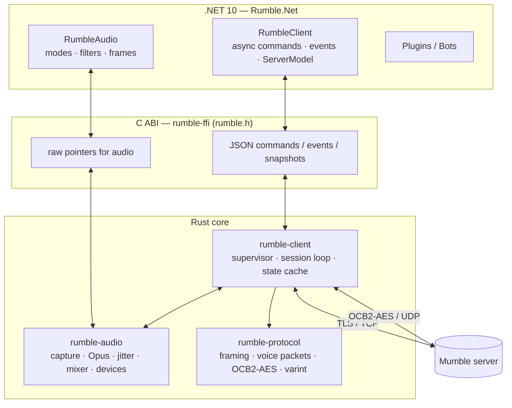

# Architecture

## Crates

| Crate | Responsibility | Notes |
|---|---|---|
| `rumble-protocol` | Control framing (`type:u16, len:u32, protobuf`), Mumble protobuf types, legacy and protobuf UDP voice packets, varints, the OCB2-AES128 crypt state, version helpers | No I/O, so it's easy to fuzz and benchmark. Protobufs are compiled by `protox` (no system `protoc`). |
| `rumble-audio` | Opus encoder/decoder, PCM fallback, adaptive jitter buffer, lock-free mixer, capture pipeline with VAD/PTT, DSP, resamplers, positional gains, `cpal` devices | Opus comes from `unsafe-libopus`, a pure-Rust libopus translation, so no C toolchain is needed. |
| `rumble-client` | Connection supervisor, session loop, server state cache, event and command types, TLS configuration, server query | Built on tokio and rustls (ring provider). |
| `rumble-ffi` | Stable C ABI, panic isolation, logging bridge, benchmarks, embedded mock server | Builds as a `cdylib` for desktop and Android and a `staticlib` for iOS. |
| `rumble-mock-server` | In-process Mumble server with EchoBot | Used by the tests, benchmarks, RumbleGallery and the RumbleApp demo. |

## Threads and data flow

The core runs these threads:

- **tokio runtime** (`rumble-io`, 2–8 workers). One *supervisor* task per client owns the connect → session → back-off → reconnect cycle. The *session loop* is a single `select!` over:
  - commands from .NET (an unbounded channel)
  - TLS reads (`FrameDecoder` works incrementally over one `BytesMut`)
  - encrypted UDP datagrams
  - encoded voice from the capture pipeline (a bounded channel)
  - the heartbeat and housekeeping timers
- **Writer task.** Queued frames are coalesced into a single TLS flush.
- **Audio thread.** This is either the `cpal` device callback or, in headless mode, a 10 ms clock thread. It owns the `Mixer` and the per-speaker jitter buffers.
- **Capture.** The device input callback, or `SendPcm` in headless mode, drives the `CapturePipeline` directly.

Received voice follows this path:

`UDP datagram → CryptState::decrypt → voice::decode_udp → VoiceRouter::route (SPSC ring buffer, wait-free) → Mixer: JitterBuffer → Opus decode / PLC → volume and positional gains → device output`

Outgoing voice follows this path:

`microphone → resample to 48 kHz mono → DC filter / noise gate / .NET filters → VAD / PTT → packetizer (10–60 ms) → Opus → try_send into the session → encode_voice → encrypt → UDP (or the TCP tunnel when UDP is unconfirmed)`

After warm-up, the audio thread doesn't take locks or allocate memory. Mixer commands such as volume changes or a new speaker arrive through a separate SPSC queue.

## Resilience

- **Heartbeat.** A TCP ping goes out every `PingInterval`, and the session is declared dead after `PingTimeout` without a reply. The client also sends UDP pings. If more than three go unanswered, voice falls back to the TCP tunnel, and it switches back to UDP automatically once UDP answers again.
- **Crypt resync.** Repeated decrypt failures trigger a `CryptSetup` nonce resync request, rate-limited to one every 5 s.
- **Reconnect.** Exponential backoff with ±20 % jitter, bounded by `ReconnectMinDelay`, `ReconnectMaxDelay` and `MaxReconnectAttempts`. Rejections, kicks and certificate mismatches are fatal and are never retried.

## The .NET layer

- **Interop.** `LibraryImport` with only blittable signatures, so there are no marshalling stubs. Handles are `SafeHandle`s (`RumbleClientSafeHandle`) so disposal can't race in-flight calls. Callbacks are `[UnmanagedCallersOnly]` function pointers with a weak `GCHandle` as user data.
- **Events.** The native thread parses the JSON using `System.Text.Json` source generation and writes into an unbounded channel. A single reader loop updates `ServerModel` and then raises typed events in order, so event handlers never run on native threads. Unknown future event types arrive as `UnknownEvent`.
- **Model.** `ServerModel` holds immutable `Channel` and `User` snapshots in concurrent dictionaries. Navigation properties (`Parent`, `Children`, `Users`, `Descendants()`) resolve against the live model, which is what makes LINQ queries work.
- **Requests.** Methods such as `JoinChannelAsync` register a waiter for the matching confirmation event. They fail on `PermissionDenied` or a disconnect and time out after `CommandTimeout`.

## Protocol compatibility

- The client advertises protocol version 1.5 and uses the **protobuf UDP format** when the server is 1.5 or newer. Otherwise it uses the legacy format, and decoding falls back to the other format automatically.
- **Opus** is the only transmit codec, as it is for current Mumble clients. **CELT alpha/beta and Speex** frames are parsed and concealed as silence. They can't be decoded, because no memory-safe CELT 0.7/0.11 implementation exists and Mumble servers have required Opus since 1.2.4. **PCM** is supported for local pipelines and tests (`StreamCodec.Pcm`).
