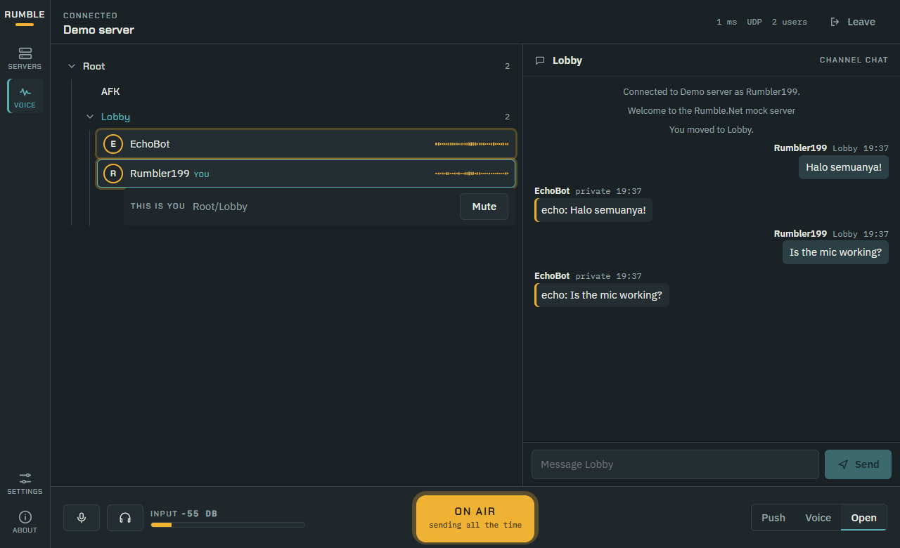

# Getting started

## Install

```powershell
dotnet add package Rumble.Net
dotnet add package Rumble.Net.Bots   # optional: bot framework and AI chat
```

The package ships `rumble_native` for each runtime identifier under `runtimes/{rid}/native`, so you don't need anything else at runtime. To build from source instead, see [building-and-packaging.md](building-and-packaging.md).

## Connect

```csharp
using Rumble.Net;

await using var client = new RumbleClient(new RumbleClientOptions
{
    Host = "voice.example.org",
    Port = 64738,
    Username = "Alice",
    Password = null,                       // server or account password, if the server needs one
});

await client.ConnectAsync();               // returns once the server state is synchronized
Console.WriteLine($"Connected as {client.Self!.Name} to {client.Server.Info.Version}");
```

`ConnectAsync` throws `RumbleConnectionException` when the server can't be reached or rejects you. For rejections, `RejectType` holds the reason, such as `WrongServerPw`, `UsernameInUse` or `ServerFull`.

## Explore and talk

```csharp
foreach (var channel in client.Channels)            // depth-first tree walk
    Console.WriteLine($"{new string(' ', channel.Depth * 2)}{channel.Name} ({channel.Users.Count()})");

await client.JoinChannelAsync("Lobby");              // by name, by path ("Games/Minecraft") or by Channel
client.SendChannelMessage("Hi everyone!");

client.ChannelMessageReceived += (_, m) => Console.WriteLine($"{m.Sender?.Name}: {m.PlainText}");
client.UserJoined += (_, user) => Console.WriteLine($"{user.Name} connected");
```

## Voice

```csharp
var options = new RumbleClientOptions { Host = "voice.example.org", Username = "Alice" };
options.Audio.Mode = AudioMode.Devices;               // microphone and speakers
options.Audio.TransmitMode = TransmitMode.PushToTalk;

await using var client = new RumbleClient(options);
await client.ConnectAsync();

client.Audio.PushToTalk = true;                       // hold…
client.Audio.PushToTalk = false;                      // …release
```

Bots and servers without audio hardware use `AudioMode.Headless`. You push PCM with `client.Audio.SendPcm(...)` and receive decoded frames through `client.Audio.AudioFrameReceived`. See [audio.md](audio.md).

## Try it offline

The SDK includes a mock Mumble server that speaks the real protocol:

```csharp
using Rumble.Net.Testing;

using var server = MockMumbleServer.Start();
await using var client = new RumbleClient(server.CreateClientOptions("tester"));
await client.ConnectAsync();
await client.JoinChannelAsync(MockMumbleServer.LobbyChannelId);
client.SendChannelMessage("ping");   // EchoBot replies "echo: ping" and plays back your voice
```

This is what the demo server looks like in RumbleApp:



## Next steps

- Browse runnable examples: `dotnet run --project samples/RumbleGallery`
- Read the [Client API](client-api.md) guide
