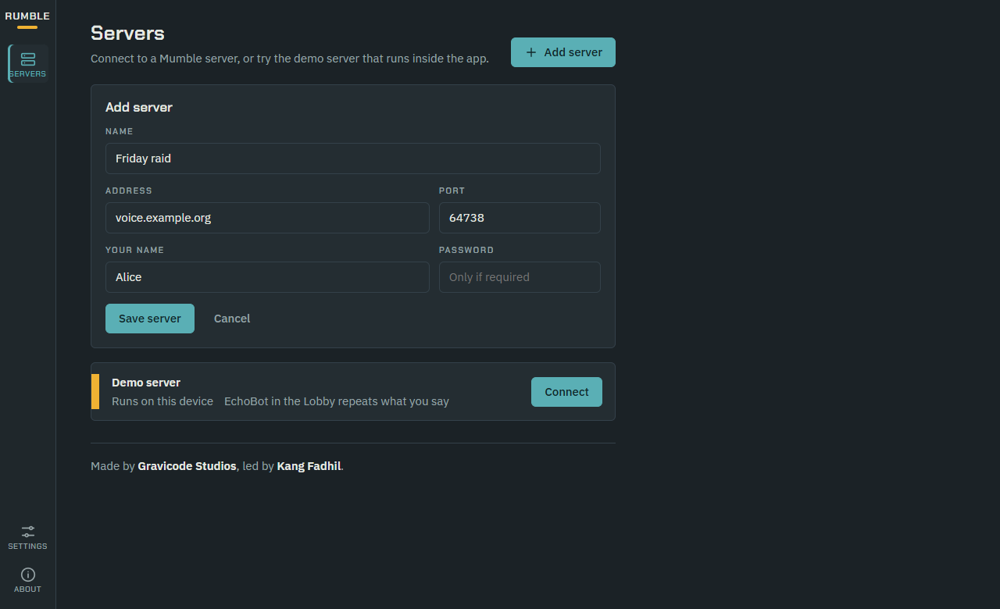
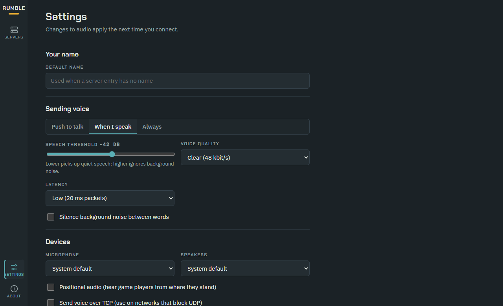
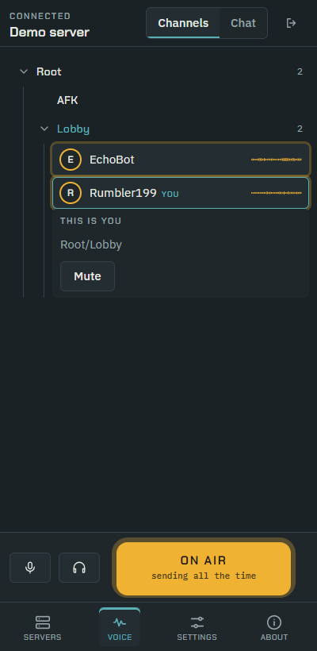
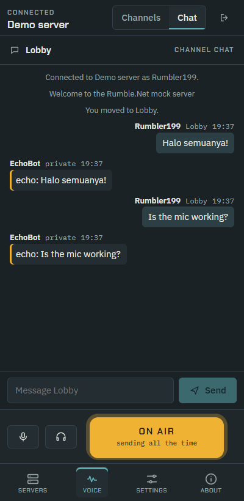
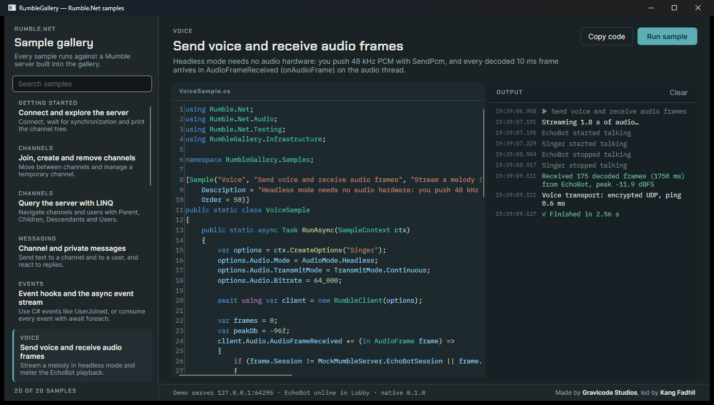

# Samples

## RumbleApp — voice chat client (.NET MAUI Blazor Hybrid)

`samples/RumbleApp` is a Mumla-style client for Windows, Android, iOS and macOS (Mac Catalyst).


| Servers | Settings | Mobile: channels | Mobile: chat |
|---|---|---|---|
|  |  |  |  |

```powershell
dotnet build samples/RumbleApp -f net10.0-windows10.0.19041.0
samples/RumbleApp/bin/Debug/net10.0-windows10.0.19041.0/win-x64/RumbleApp.exe
```

Features:

- **Servers.** Saved servers with live status from a UDP query (users and ping), plus a built-in **demo server** with EchoBot. You can add, edit and remove servers.
- **Voice screen:**
  - a channel tree where you double-click or press **Join** to enter a channel
  - a live **voice trace** for each user, built from decoded frames
  - mute and deafen badges, and a local volume slider and mute for each user
  - channel and private chat
  - a transmit strip with mic and deafen toggles, the input meter with the VAD threshold marker, a big push-to-talk key (also the <kbd>Space</kbd> key), and a Push / Voice / Open mode switch
  - reconnect notices
- **Settings.** Default name, transmit mode, speech threshold, voice quality, latency, noise gate, input and output devices, positional audio, TCP voice, and certificate identity creation.
- **Responsive layout.** A side rail on desktop. Below 900 px the Channels and Chat panes become tabs, and below 720 px the rail moves to a bottom bar.

### Design

The design direction is a *broadcast console*. The screens use anodized-slate panels, a single amber accent taken from VU meters (reserved for "someone is on air"), and teal for controls. Type is Chakra Petch for hardware-style labels, IBM Plex Sans for content and IBM Plex Mono for telemetry. The signature element is the amber **voice trace** ribbon: each user's decoded audio level over the last ~1.8 s.

- Light and dark themes follow the OS.
- Fonts are bundled, so the app works offline.

Files:

- Design tokens: `samples/RumbleApp/wwwroot/css/app.css`
- Connection logic: `Services/VoiceSession.cs`, which wraps `RumbleClient` for the whole app

### Mobile native libraries

Android and iOS need the core built for their targets:

```powershell
./build/build-native.ps1 -Rids android-arm64   # requires the Android NDK (cargo-ndk or a configured linker)
./build/build-native.sh ios-arm64              # on macOS
```

The app's `.csproj` picks up `src/Rumble.Net/runtimes/android-arm64/native/librumble_native.so` and `ios-arm64/native/librumble_native.a` when they exist.

## RumbleGallery — SDK sample gallery (Avalonia)

`samples/RumbleGallery` is a desktop app for Windows, Linux and macOS. It lists runnable samples, shows each sample's **exact source** with syntax highlighting (AvaloniaEdit and TextMate), and streams the output while the sample runs against a mock server built into the app.



```powershell
dotnet run --project samples/RumbleGallery
dotnet run --project samples/RumbleGallery -- --run-all      # headless: run every sample (used by CI)
```

| Category | Samples |
|---|---|
| Getting started | Connect and explore the server |
| Channels | Join/create/remove channels · Query the server with LINQ |
| Messaging | Channel and private messages |
| Events | Event hooks and the async event stream |
| Voice | Send voice and receive audio frames · Positional audio |
| Audio | Capture filters · Opus encoding and packet loss concealment |
| Plugins | Record voices to WAV files · Write your own plugin |
| Bots | Build a command bot · AI chat bot with IChatClient |
| Resilience | Automatic reconnect |
| Security | Certificates and TLS pinning |
| User management | Mute, move and kick users |
| Diagnostics | Logging with ILogger · Ping a server without connecting · Native benchmarks |
| Integration | Dependency injection |

To add a sample, drop a static class into `samples/RumbleGallery/Samples/` with `[Sample(category, title, summary)]` and `public static Task RunAsync(SampleContext ctx)`. The gallery discovers it and embeds its source automatically.
