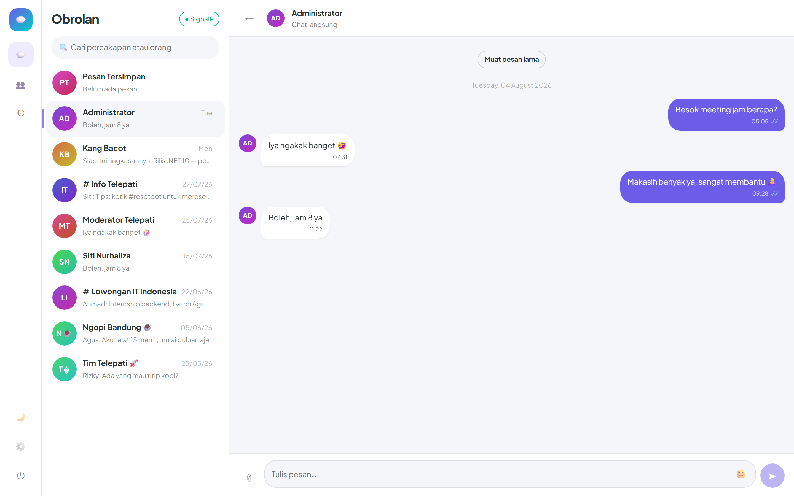
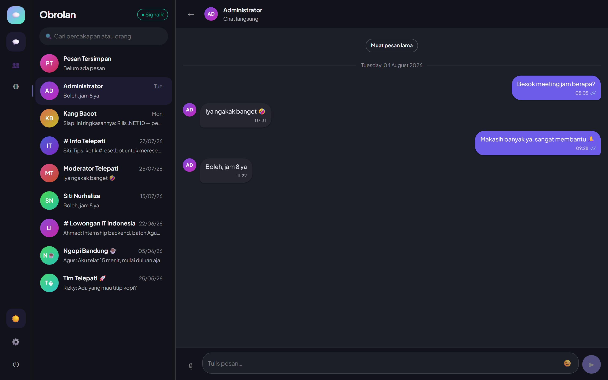
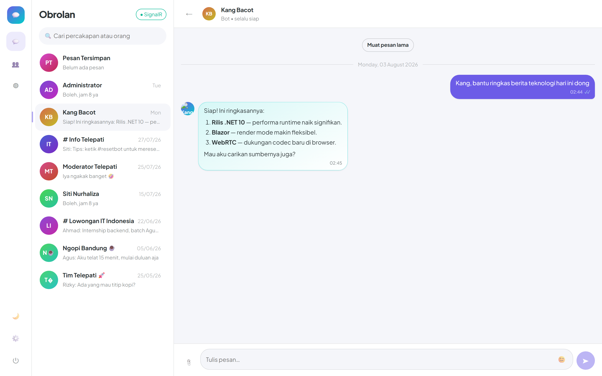
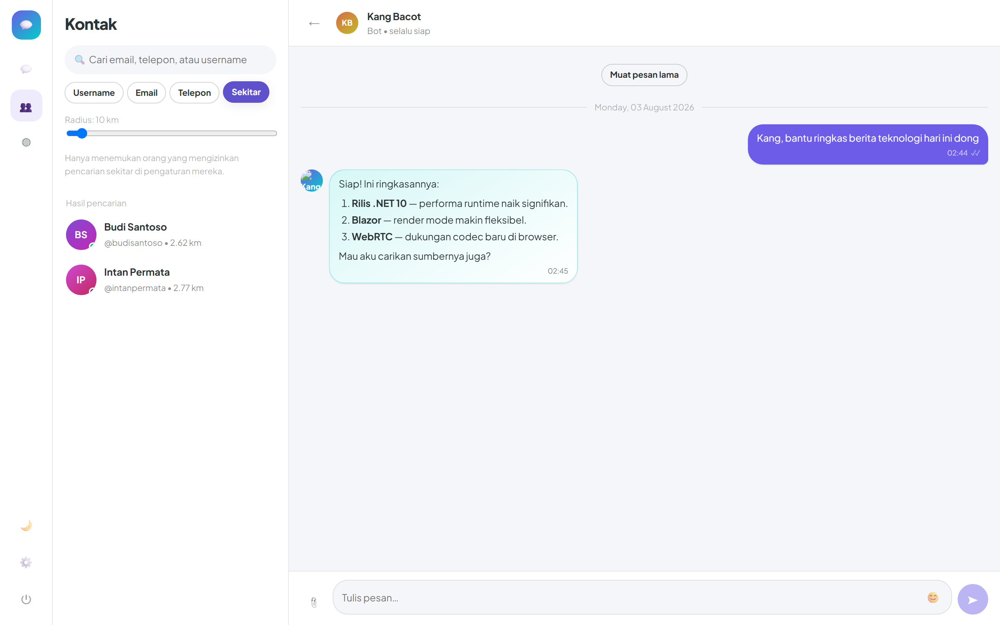

<div align="center">

# 💬 Telepati

**Ngobrol seru, tanpa jeda.**

Messenger modern untuk web, desktop, dan mobile — dibangun di atas .NET 10.

Dibuat oleh **Gravicode Studios**, dipimpin oleh **Kang Fadhil**.

[Bahasa Indonesia](#bahasa-indonesia) · [English](#english)

</div>

---

## Bahasa Indonesia

### Apa itu Telepati

Telepati adalah aplikasi pesan instan lengkap: chat realtime, grup, channel, panggilan suara dan video, status 24 jam, serta bot temen ngobrol bernama **Kang Bacot**. Satu server melayani empat aplikasi klien — web, admin, desktop, dan mobile — yang semuanya berbagi satu pustaka UI.

Dua keputusan membentuk seluruh arsitekturnya:

**Transport adalah pilihan pengguna.** Setiap klien bisa berbicara dengan server lewat SignalR (bawaan), gRPC, atau REST, dan bisa berpindah dari halaman pengaturan tanpa restart. Logika bisnis di server tidak tahu transport mana yang dipakai.

**Semua dependensi bisa ditukar dari konfigurasi.** Database, cache, storage, dan model AI dipilih lewat appsettings — dan bisa diubah dari aplikasi admin tanpa deploy ulang.

### Tampilan



| | |
|---|---|
|  |  |
| **Mode gelap** — enam token warna diganti, bukan sekadar dibalik | **Kang Bacot** — jawaban Markdown dengan tabel dan blok kode |
|  |  |
| **Cari orang di sekitar** — radius 5–100 km, hanya yang mengizinkan | **Pengaturan** — transport, tema, penyimpanan lokal, privasi |


Lebih lengkap di [docs/screenshots/](docs/screenshots/) — 21 gambar, semuanya diambil dari
aplikasi yang benar-benar berjalan.

### Sekilas fitur

| Kelompok | Yang tersedia |
|----------|---------------|
| **Percakapan** | Chat langsung, grup berperan (owner/admin/moderator), channel broadcast, pesan tersimpan |
| **Pesan** | Teks, gambar, video, audio, dokumen, lokasi, sticker, emoji, reply, forward, pin, reaksi, mention |
| **Panggilan** | Suara dan video lewat WebRTC — media langsung antar-perangkat, server hanya merelai sinyal |
| **Status** | Teks, gambar, atau video yang hilang setelah 24 jam |
| **Kontak** | Cari lewat email, nomor telepon, username, atau **orang di sekitar** (radius 5–100 km, hanya bagi yang mengizinkan) |
| **Berbagi kontak** | Kartu QR untuk dibagikan dan dipindai; impor dari buku telepon |
| **Privasi** | Blokir, laporkan, kelola perangkat yang login, 2FA TOTP, enkripsi ujung-ke-ujung (opsional) |
| **Bot** | Kang Bacot: ngobrol, cari internet, baca file, hitung, jalankan skrip, kirim hasil |
| **Skills & MCP** | Pasang skill dari repo tepercaya — instruksi, referensi, dan skrip yang bisa dijalankan; daftarkan server MCP (28 bawaan) yang menyumbang tool ke bot |
| **Admin** | Dashboard realtime, kelola pengguna, statistik grup, laporan pengiriman, log aktivitas, tema, backup |
| **Offline** | Desktop & mobile menyimpan data ke SQLite atau LiteDB; web memakai IndexedDB — aplikasi langsung terisi saat dibuka |

### Menjalankan

Butuh **.NET 10 SDK**. Tidak butuh database, Redis, atau layanan cloud untuk mode pengembangan — bawaannya SQLite, MemoryCache, dan penyimpanan berkas lokal.

```bash
git clone <repo>
cd Telepati
dotnet build

# Terminal 1 — server (REST + SignalR + gRPC + Swagger)
dotnet run --project src/Telepati.Server
#   https://localhost:7180/swagger

# Terminal 2 — aplikasi messenger
dotnet run --project src/Telepati.Web
#   https://localhost:7200

# Terminal 3 — konsol admin
dotnet run --project src/Telepati.Admin
#   https://localhost:7210
```

Saat pertama dijalankan, server membuat skema dan mengisi data contoh: **26 akun, 5 grup, 3 channel, dan ratusan pesan**.

**Akun demo** (semua memakai password `Telepati123!`):

| Username | Peran |
|----------|-------|
| `kangfadhil` | Super Admin |
| `admin` | Admin |
| `sitinurhaliza`, `budisantoso`, … | Pengguna biasa |

Aplikasi desktop dan mobile:

```bash
dotnet run --project src/Telepati.Desktop                        # Avalonia
dotnet build src/Telepati.Mobile -f net10.0-android              # MAUI Blazor
```

### Menjalankan tes

```bash
dotnet test                                              # semua
dotnet test --filter "FullyQualifiedName~MessagingTests" # satu kelas
dotnet test --filter "Nearby_search"                     # satu tes
```

### Bentuk solusinya

```
Telepati.sln
├── src/
│   ├── Telepati.Domain          Entitas dan enum — tanpa dependensi
│   ├── Telepati.Shared          DTO, opsi konfigurasi, kontrak .proto
│   ├── Telepati.Infrastructure  EF Core, cache, storage, seluruh layanan domain
│   ├── Telepati.Bot             Kang Bacot (Semantic Kernel + kernel functions)
│   ├── Telepati.Server          ASP.NET Core: Minimal API + SignalR + gRPC
│   ├── Telepati.Client.Core     Abstraksi transport (SignalR / gRPC / REST)
│   ├── Telepati.UI              Pustaka komponen Blazor bersama + sistem tema
│   ├── Telepati.Web             Aplikasi messenger (Blazor Server)
│   ├── Telepati.Admin           Konsol admin (Blazor Server)
│   ├── Telepati.Desktop         Avalonia + host Blazor in-process
│   └── Telepati.Mobile          MAUI Blazor (Android, iOS, Mac Catalyst, Windows)
└── tests/Telepati.Tests         xUnit di atas SQLite in-memory
```

Dokumentasi lengkap ada di [`docs/`](docs/):

- [Arsitektur](docs/architecture.md) — bagaimana ketiga transport berbagi satu logika
- [Konfigurasi](docs/configuration.md) — setiap kunci dan artinya
- [Kang Bacot](docs/bot.md) — perintah, kernel function, dan sandbox
- [API](docs/api.md) — permukaan REST, SignalR, dan gRPC
- [Deployment](docs/deployment.md) — pindah ke PostgreSQL, Redis, S3
- [Penyimpanan klien](docs/client-storage.md) — SQLite/LiteDB di desktop & mobile, IndexedDB di web
- [Skills & MCP](docs/skills-and-mcp.md) — memasang skill, menjalankan skripnya, mendaftarkan server MCP
- [Panduan UI](docs/ui-design.md) — sistem desain dan tema musiman
- [Tangkapan layar](docs/screenshots/) — 21 gambar dari aplikasi yang berjalan
- [Performance.md](Performance.md) — hasil pengukuran setelah optimisasi

### Pilihan provider

Semua diubah lewat `appsettings.json` atau halaman Pengaturan di aplikasi admin.

| Kebutuhan | Pengembangan | Produksi |
|-----------|--------------|----------|
| **Database** | SQLite | SQL Server · MySQL · PostgreSQL (dengan sharding) |
| **Cache** | MemoryCache | Redis |
| **Storage** | Berkas lokal | Azure Blob · Amazon S3 · MinIO |
| **Model AI** | Ollama (lokal) | OpenAI · Anthropic · Gemini |

### Lisensi

Hak cipta © Gravicode Studios.

---

## English

### What Telepati is

Telepati is a complete instant messenger: realtime chat, groups, channels, voice and video calls, 24-hour status, and a conversational bot called **Kang Bacot**. One server backs four client apps — web, admin, desktop, and mobile — all sharing a single UI library.

Two decisions shape the whole architecture:

**Transport is the user's choice.** Every client can talk to the server over SignalR (default), gRPC, or REST, switchable from its settings page without a restart. The server's business logic never learns which one is in use.

**Every dependency is swappable from configuration.** Database, cache, storage, and AI model are selected in appsettings — and can be changed from the admin app without redeploying.

### Screenshots


| | |
|---|---|
|  |  |
| **Dark mode** — six colour tokens replaced, not inverted | **Kang Bacot** — Markdown replies with tables and code blocks |
|  |  |
| **Find people nearby** — 5–100 km radius, opt-in only | **Settings** — transport, theme, local storage, privacy |


More in [docs/screenshots/](docs/screenshots/) — 21 images, all captured from the running apps.

### Feature summary

| Area | What's there |
|------|--------------|
| **Conversations** | Direct chats, role-based groups (owner/admin/moderator), broadcast channels, saved messages |
| **Messages** | Text, image, video, audio, documents, location, stickers, emoji, reply, forward, pin, reactions, mentions |
| **Calls** | Voice and video over WebRTC — media flows peer-to-peer, the server only relays signalling |
| **Status** | Text, image, or video that expires after 24 hours |
| **Contacts** | Search by email, phone, username, or **people nearby** (5–100 km radius, opt-in only) |
| **Contact sharing** | QR cards to share and scan; phone-book import |
| **Privacy** | Block, report, manage signed-in devices, TOTP 2FA, optional end-to-end encryption |
| **Bot** | Kang Bacot: chat, web search, file reading, calculation, script execution, result delivery |
| **Skills & MCP** | Install skills from trusted repos — instructions, references, and runnable scripts; register MCP servers (28 built in) that contribute tools to the bot |
| **Admin** | Realtime dashboard, user management, group insights, delivery reports, activity log, themes, backup |
| **Offline** | Desktop & mobile cache to SQLite or LiteDB; web uses IndexedDB — the app paints from storage on open |

### Running it

Requires the **.NET 10 SDK**. No database, Redis, or cloud service needed for development — it defaults to SQLite, MemoryCache, and local file storage.

```bash
git clone <repo>
cd Telepati
dotnet build

# Terminal 1 — server (REST + SignalR + gRPC + Swagger)
dotnet run --project src/Telepati.Server
#   https://localhost:7180/swagger

# Terminal 2 — messenger app
dotnet run --project src/Telepati.Web
#   https://localhost:7200

# Terminal 3 — admin console
dotnet run --project src/Telepati.Admin
#   https://localhost:7210
```

On first run the server creates the schema and seeds sample data: **26 accounts, 5 groups, 3 channels, and hundreds of messages**.

**Demo accounts** (all use the password `Telepati123!`):

| Username | Role |
|----------|------|
| `kangfadhil` | Super Admin |
| `admin` | Admin |
| `sitinurhaliza`, `budisantoso`, … | Regular users |

Desktop and mobile:

```bash
dotnet run --project src/Telepati.Desktop                        # Avalonia
dotnet build src/Telepati.Mobile -f net10.0-android              # MAUI Blazor
```

### Running the tests

```bash
dotnet test                                              # everything
dotnet test --filter "FullyQualifiedName~MessagingTests" # one class
dotnet test --filter "Nearby_search"                     # one test
```

### Solution shape

```
Telepati.sln
├── src/
│   ├── Telepati.Domain          Entities and enums — no dependencies
│   ├── Telepati.Shared          DTOs, configuration options, .proto contract
│   ├── Telepati.Infrastructure  EF Core, cache, storage, all domain services
│   ├── Telepati.Bot             Kang Bacot (Semantic Kernel + kernel functions)
│   ├── Telepati.Server          ASP.NET Core: Minimal API + SignalR + gRPC
│   ├── Telepati.Client.Core     Transport abstraction (SignalR / gRPC / REST)
│   ├── Telepati.UI              Shared Blazor component library + theme system
│   ├── Telepati.Web             Messenger app (Blazor Server)
│   ├── Telepati.Admin           Admin console (Blazor Server)
│   ├── Telepati.Desktop         Avalonia + in-process Blazor host
│   └── Telepati.Mobile          MAUI Blazor (Android, iOS, Mac Catalyst, Windows)
└── tests/Telepati.Tests         xUnit over in-memory SQLite
```

Full documentation lives in [`docs/`](docs/):

- [Architecture](docs/architecture.md) — how three transports share one set of logic
- [Configuration](docs/configuration.md) — every key and what it does
- [Kang Bacot](docs/bot.md) — commands, kernel functions, and the sandbox
- [API](docs/api.md) — the REST, SignalR, and gRPC surfaces
- [Deployment](docs/deployment.md) — moving to PostgreSQL, Redis, S3
- [Client storage](docs/client-storage.md) — SQLite/LiteDB on desktop & mobile, IndexedDB on web
- [Skills & MCP](docs/skills-and-mcp.md) — installing skills, running their scripts, registering MCP servers
- [UI guide](docs/ui-design.md) — the design system and seasonal themes
- [Screenshots](docs/screenshots/) — 21 images captured from the running apps
- [Performance.md](Performance.md) — measured results after tuning

### Provider choices

All switchable via `appsettings.json` or the admin app's Settings page.

| Concern | Development | Production |
|---------|-------------|------------|
| **Database** | SQLite | SQL Server · MySQL · PostgreSQL (with sharding) |
| **Cache** | MemoryCache | Redis |
| **Storage** | Local files | Azure Blob · Amazon S3 · MinIO |
| **AI model** | Ollama (local) | OpenAI · Anthropic · Gemini |

### License

Copyright © Gravicode Studios.
