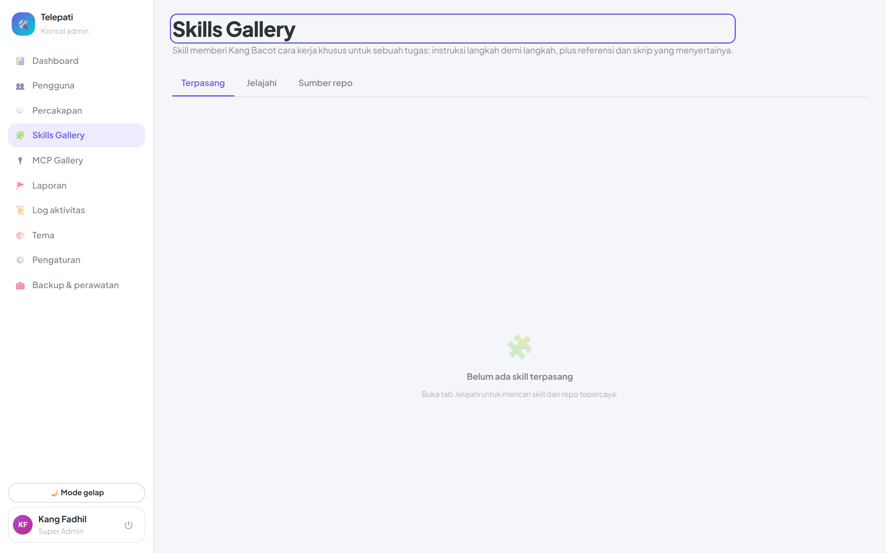
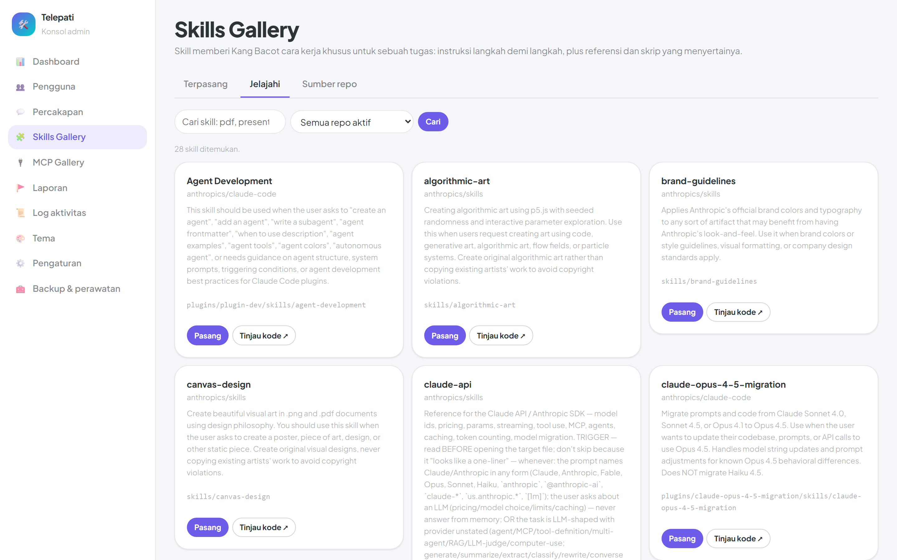
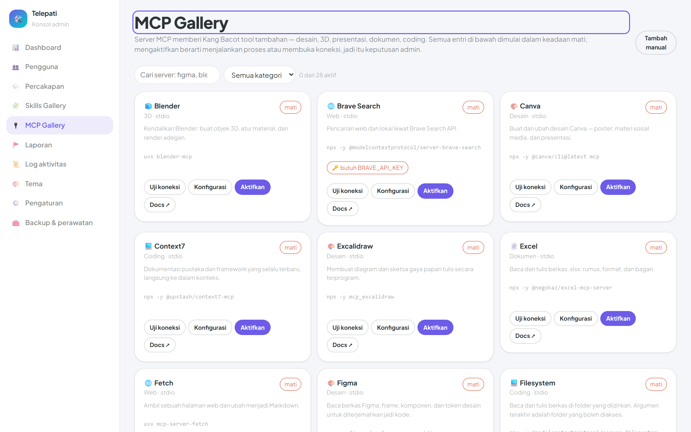

# Skills & MCP

Dua galeri di konsol admin memperluas kemampuan Kang Bacot tanpa menyentuh kode:

- **Skills Gallery** — memasang *skill*: satu folder berisi `SKILL.md`, skrip, dan dokumen
  referensi. Bot membaca instruksinya, membuka referensinya, dan — bila diizinkan — menjalankan
  skripnya.
- **MCP Gallery** — mendaftarkan server [Model Context Protocol](https://modelcontextprotocol.io),
  yang menyumbang tool siap pakai ke kernel bot.

Keduanya ada di **Admin → Skills** dan **Admin → MCP**.



---

## Bagian 1 — Skills

### Apa isi sebuah skill

Sebuah skill adalah folder. Yang wajib hanya satu berkas:

```
menulis-notulen/
├── SKILL.md              ← wajib
├── scripts/
│   └── ringkas.py
└── references/
    ├── format-notulen.md
    └── contoh.md
```

`SKILL.md` diawali frontmatter YAML, lalu badan Markdown yang menjadi instruksi:

```markdown
---
name: Menulis Notulen
description: Merapikan catatan rapat mentah menjadi notulen berformat baku.
version: 1.2.0
author: Gravicode
license: MIT
---

Ubah catatan mentah menjadi notulen dengan urutan: peserta, keputusan, tindak lanjut.
Baca `references/format-notulen.md` sebelum mulai — di situ ada aturan penomorannya.
Untuk catatan lebih dari 2.000 kata, jalankan `scripts/ringkas.py` lebih dulu.
```

`description` adalah bagian terpenting. Itulah satu-satunya teks yang dilihat model saat memilih
skill, jadi tulis kapan skill ini dipakai — bukan sekadar apa namanya.

### Pengungkapan bertahap

Instruksi lengkap semua skill tidak pernah dijejalkan ke prompt. Bot melihat daftar
`nama + description` saja, lalu menarik sisanya hanya untuk skill yang ia pilih:

| Langkah | Kernel function | Yang dimuat |
|---------|-----------------|-------------|
| 1 | `ListSkills` | nama dan deskripsi setiap skill aktif |
| 2 | `LoadSkill` | badan `SKILL.md` + daftar berkas yang tersedia |
| 3 | `ReadReference` | satu dokumen referensi, saat memang dibutuhkan |
| 4 | `ListSkillFiles` | isi folder skill |
| 5 | `RunSkillScript` | menjalankan satu skrip bawaan |

Tanpa ini, dua puluh skill terpasang berarti dua puluh instruksi penuh di setiap giliran.

### Menjalankan skrip

Ini yang membedakan skill dari sekadar potongan prompt — dan yang membuatnya perlu dijaga.
Eksekusi dijaga **tiga gerbang terpisah** yang ketiganya harus lolos:

1. **`Bot:EnableCodeExecution`** — saklar global di pengaturan aplikasi.
2. **`AllowScriptExecution` per skill** — mati saat dipasang. Memasang skill dan mengizinkannya
   menjalankan skrip sengaja dijadikan dua keputusan berbeda.
3. **`Bot:AllowedExecutors`** — daftar izin interpreter. Bawaannya
   `["powershell", "python", "dotnet", "cmd", "node"]`, jadi skrip `.py`, `.ps1`, dan `.js`
   langsung bisa dijalankan. `bash` sengaja **tidak** ikut: `.sh` ditolak sebelum dijalankan
   sampai admin menambahkannya sendiri.

Interpreter dipilih dari ekstensi berkas — `.py` → python, `.ps1` → powershell/pwsh,
`.sh` → bash, `.js`/`.mjs` → node — lalu dicocokkan dengan daftar izin di atas.

Di atas itu berlaku batasan yang sama seperti sandbox bot:

- Path diselesaikan lewat `ResolveInsideSkill`, yang menolak path absolut dan `../`.
- Skrip hanya boleh berada di dalam folder skill itu sendiri.
- Argumen diserahkan sebagai argumen proses; tidak ada shell string yang dirakit dari masukan
  model.
- `Bot:ExecutionTimeoutSeconds` (bawaan 120) membatasi lamanya, dan keluaran dipotong sebelum
  kembali ke model.

Kalau salah satu gerbang tertutup, bot menjawab apa adanya — misalnya
`"Skill 'x' belum diizinkan menjalankan skrip."` — bukan gagal diam-diam.

### Memasang dari repositori



Skill hanya bisa dipasang dari repositori yang terdaftar di **Sumber**. Satu repositori berisi
`owner/repo`, branch, dan sub-folder opsional.

Pengindeksan memakai **satu panggilan** GitHub tree API (`?recursive=1`) lalu menyaring hasilnya
untuk `SKILL.md`. Menelusuri folder satu per satu akan menghabiskan kuota rate limit pada repo
besar.

Pemasangan mengunduh arsip zip repositori dan mengekstrak hanya sub-pohon skill-nya. Dua hal
yang dijaga saat ekstraksi:

```csharp
var destination = Path.GetFullPath(Path.Combine(target, relative));
// Sebuah entri zip bisa menyebut "../" dan keluar dari foldernya; tolak langsung.
if (!destination.StartsWith(target, StringComparison.OrdinalIgnoreCase)) { ...gagal... }
```

dan batas ukuran: **12 MB** serta **400 berkas** per skill. Zip yang lebih besar ditolak sebelum
apa pun ditulis ke disk.

Skill terpasang masuk ke `Workspace/skills/<slug>/`, dengan
`AllowScriptExecution = false`.

### Menambah sumber baru

**Skills → Sumber → Tambah sumber**. Isi `owner/repo`, branch, dan path. Sumber bawaan ditandai
`IsOfficial` dan tidak bisa dihapus — hanya dinonaktifkan.

Perlakukan ini sebagai keputusan keamanan. Menambahkan repositori berarti memberi pemiliknya jalur
untuk mengirim skrip ke mesin yang menjalankan bot.

---

## Bagian 2 — MCP



MCP server menyumbang tool. Begitu satu server diaktifkan dan sehat, tool-nya muncul di kernel
Kang Bacot bersama fungsi bawaan, dan model memilihnya sendiri.

### Dua transport

| Transport | Cara kerja | Dipakai untuk |
|-----------|-----------|---------------|
| **Stdio** | Diluncurkan sebagai proses anak, bicara lewat stdin/stdout | Paket `npx` / `uvx` yang jalan lokal |
| **Http** | Endpoint jarak jauh (streamable atau SSE) | Layanan yang sudah di-host |

Server stdio dijalankan **di mesin server**. Karena itu `Command` dan `Arguments` diperlakukan
sebagai konfigurasi milik admin — tidak pernah sesuatu yang bisa dipengaruhi model atau pengguna
akhir.

### Katalog bawaan

28 server terkurasi ikut ter-*seed* — Coding (5), Web (4), Document (4), Design (3),
ThreeD (3), Data (3), Productivity (3), Presentation (2), General (1).

Semuanya **masuk dalam keadaan nonaktif**. Mengaktifkan satu per satu adalah keputusan sadar,
dan sebagian butuh kunci API sebelum bisa dipakai sama sekali.

### Konfigurasi dan rahasia

Setiap server punya `EnvironmentVariables` berupa `KEY=value` satu per baris. Nilai yang tampak
seperti rahasia **ditutup** di DTO — form menampilkan `••••••`, bukan kuncinya.

Penyamaran itu membawa jebakan yang sudah pernah terjadi di sini: menyimpan form berarti
mengirim balik topengnya. `MergeEnvironment` memulihkan nilai asli untuk setiap kunci yang
kembali dalam keadaan tertutup:

```csharp
merged.Add(value == "••••••" && existing.TryGetValue(key, out var original) ? original : trimmed);
```

Tanpa itu, mengubah kategori atau homepage saja sudah cukup untuk mengganti kunci API yang
berfungsi dengan enam titik.

### Uji koneksi

Tombol **Uji** membuka koneksi, memanggil `tools/list`, lalu menyimpan hasilnya
(`LastCheckSucceeded`, `LastCheckedAt`, `LastCheckMessage`, `DiscoveredTools`) supaya galeri bisa
menunjukkan mana yang benar-benar hidup. Server stdio yang perintahnya tidak terpasang akan
gagal di sini — bukan diam-diam saat pengguna sedang mengobrol.

### Cache dan cooldown

`McpToolProvider` menyimpan klien per proses: server stdio adalah proses anak, dan menyalakan
ulang satu proses per giliran chat tidak masuk akal. Server yang gagal masuk **cooldown 5 menit**
supaya satu server rusak tidak memperlambat setiap balasan.

### Menambah manual

**MCP → Tambah server**. Isi nama, kategori, transport, lalu perintah atau URL-nya. Server buatan
sendiri bisa dihapus; yang bawaan hanya bisa dinonaktifkan.

---

## Konfigurasi

| Kunci | Arti |
|-------|------|
| `Bot:EnableCodeExecution` | Saklar global eksekusi skrip. Mematikan ini melumpuhkan semua `RunSkillScript`, apa pun izin per skill-nya |
| `Bot:AllowedExecutors` | Interpreter yang boleh dipanggil. Bawaan: `powershell`, `python`, `dotnet`, `cmd`, `node` |
| `Bot:ExecutionTimeoutSeconds` | Batas waktu satu skrip (bawaan 120) |
| `Bot:WorkspacePath` | Akar sandbox tempat skill dipasang dan skrip dijalankan |
| `Bot:MaxFunctionCallsPerTurn` | Batas putaran tool dalam satu giliran, termasuk tool MCP (bawaan 8) |

Skill dan server MCP disimpan di tabel `SkillRepositories`, `SkillDefinitions`, dan
`McpServerDefinitions` — bukan di appsettings — karena keduanya dikelola dari UI saat aplikasi
berjalan.

## Prinsip yang dipegang

Kalau nanti menambah sumber, transport, atau gerbang izin baru, empat aturan ini yang berlaku:

1. **Aman secara bawaan.** Skill masuk tanpa izin eksekusi; server MCP masuk dalam keadaan mati.
2. **Sumber adalah keputusan keamanan.** Pemasangan hanya dari repositori yang terdaftar.
3. **Setiap path dibatasi.** Baik `Workspace.Resolve` maupun `ResolveInsideSkill` menolak path
   absolut dan traversal — di dalam zip maupun di luar.
4. **Rahasia tidak pernah kembali dari UI.** Yang ditampilkan adalah topeng; yang disimpan adalah
   nilai lama, kecuali admin benar-benar mengetik yang baru.
