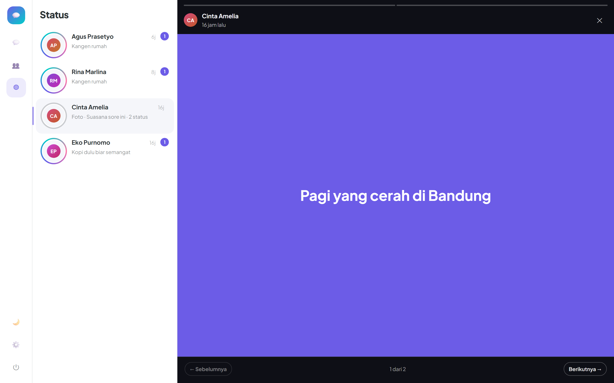

# Panduan UI

Sistem desain Telepati ada di satu berkas: [`src/Telepati.UI/wwwroot/css/telepati.css`](../src/Telepati.UI/wwwroot/css/telepati.css). Web, desktop, dan mobile memakainya apa adanya.

---


## Konsep: Gelombang

"Telepati" adalah pikiran yang berpindah dari satu orang ke orang lain. Motif itu dipakai sebagai satu elemen tanda tangan, muncul di empat tempat dan tidak di tempat lain:

| Di mana | Apa yang terjadi |
|---------|------------------|
| **Tombol kirim** | Riak konsentris memancar saat pesan dikirim — pikiran yang berangkat |
| **Avatar** | Cincin sonar berdenyut pelan pada kontak yang sedang online |
| **Percakapan aktif** | Bilah sinyal di tepi kiri, naik-turun perlahan |
| **Layar masuk** | Tiga cincin melebar dari lambang aplikasi |

Selebihnya sengaja tenang. Satu elemen yang diingat lebih baik daripada lima yang bersaing.

Semua animasi hilang sepenuhnya di bawah `prefers-reduced-motion: reduce`.

---

## Tipografi

**Plus Jakarta Sans** untuk seluruh antarmuka. Typeface ini digambar untuk identitas kota Jakarta — pilihan yang berakar pada subjeknya, bukan font netral yang muncul di semua dashboard.

**JetBrains Mono** untuk blok kode di jawaban Kang Bacot.

Skala tipe memakai `clamp()` sehingga ukuran menyesuaikan lebar layar tanpa breakpoint:

```css
--tp-step--1: clamp(0.75rem, 0.72rem + 0.15vw, 0.8125rem);  /* keterangan */
--tp-step-0:  clamp(0.875rem, 0.85rem + 0.15vw, 0.9375rem); /* teks utama */
--tp-step-1:  clamp(1rem, 0.96rem + 0.2vw, 1.0625rem);      /* judul kecil */
--tp-step-2:  clamp(1.25rem, 1.18rem + 0.35vw, 1.5rem);     /* judul bagian */
--tp-step-3:  clamp(1.75rem, 1.6rem + 0.7vw, 2.25rem);      /* judul halaman */
```

Kalau font gagal dimuat (desktop offline, jaringan lambat), tumpukan cadangan memakai font sistem.

---

## Warna

Enam token menjadi sumber semua warna. Semuanya disuntikkan saat runtime dari tema yang aktif:

```css
--tp-primary    /* ungu Telepati — aksi, bubble milik sendiri, tautan */
--tp-secondary  /* teal — bot, tanda dibaca, aksen kedua */
--tp-accent     /* koral — lencana, penekanan */
--tp-bg         /* permukaan kartu dan panel */
--tp-surface    /* latar aplikasi */
--tp-text       /* tinta utama */
```

Sisanya diturunkan dengan `color-mix()`: teks redup, garis batas, isian lembut. Artinya **satu tema hanya perlu menetapkan enam nilai** dan seluruh antarmuka ikut berubah.

Mode gelap bukan pembalikan otomatis — ia mengganti keenam token sekaligus menyesuaikan bayangan dan kontras bubble, karena hubungan kontras di gelap berbeda, bukan sekadar terbalik.

---

## Tema musiman

Tema disimpan sebagai master data (`ThemeDefinition`), bisa ditambah dari **Admin → Tema** tanpa menyentuh kode.

Tema yang ditandai musiman punya rentang tanggal. Di dalam rentang itu, ia **mengalahkan** tema yang diaktifkan admin — jadi skin Lebaran menyala dan padam sendiri.

Bawaan yang sudah tersedia:

| Tema | Rentang | Nuansa |
|------|---------|--------|
| Telepati Classic | — | Ungu segar, tema utama |
| Telepati Midnight | — | Mode gelap |
| Lebaran 🌙✨ | 18–25 Maret | Hijau emas |
| Tahun Baru 🎆 | 28 Des – 3 Jan | Biru malam, gelap |
| Kemerdekaan 🇮🇩 | 15–18 Agustus | Merah putih |
| Natal 🎄 | 20–27 Desember | Merah hijau hangat |


Membuat tema baru: pilih enam warna, isi emoji sebagai ikon aksen, centang "musiman", tentukan tanggalnya. Tombol **Pratinjau** mengecat konsol admin dengan draf itu supaya warnanya bisa dinilai di tempat.

Mode gelap bukan pembalikan otomatis — enam token diganti seluruhnya, dan nada teks sekunder
dinaikkan karena tinta terang di atas permukaan gelap kehilangan keterbacaan lebih cepat:


---

## Tata letak

Tiga panel di desktop, satu panel di ponsel:

```
┌────┬──────────────┬─────────────────────────────┐
│    │              │  Halo, apa kabar?           │
│ 💬 │  Siti      2 │                             │
│ 👥 │  Tim Telepati│           Baik dong! ✓✓     │
│ ◍  │  Budi        │                             │
│    │  # Info      │  [ Tulis pesan…      ] ➤   │
└────┴──────────────┴─────────────────────────────┘
 rail     daftar              percakapan
```

Di bawah 820px, rail pindah ke bawah sebagai tab bar dan daftar/percakapan bergantian menempati layar — dikendalikan atribut `data-tp-pane` pada shell.

Bubble memakai sudut kotak di satu sisi sebagai penunjuk arah; tidak ada ekor segitiga.

### Panel kanan bukan hanya percakapan

Panel ketiga dipakai bersama. Saat sebuah status dibuka, panel itu **bercabang** ke
`StatusViewer`, bukan ke `ChatThread`. Tanpa percabangan itu, panel tetap merender percakapan
terakhir — dan membuka status justru memperlihatkan thread chat.



Bentuknya mengikuti kebiasaan messenger lain, karena di sini keakraban lebih berharga daripada
kebaruan:

- Status **dikelompokkan per orang**. Membuka cincin seseorang memutar seluruh unggahannya
  berurutan, lalu berpindah ke orang berikutnya.
- Bilah segmen di atas — satu ruas per unggahan — menunjukkan posisi tanpa perlu angka.
- Zona ketuk kiri dan kanan menutupi seluruh panggung, seperti di ponsel; tombol
  **Sebelumnya / Berikutnya** menyediakan target yang sama untuk mouse dan keyboard.

Tiga jenis isi ditangani berbeda:

| Jenis | Tampilan | Maju sendiri |
|-------|----------|--------------|
| Teks | Kanvas berwarna dari `BackgroundColor` unggahan | setelah 6 detik |
| Gambar | Memenuhi panggung, keterangan di bawah | setelah 6 detik |
| Video | `autoplay muted controls playsinline` | **tidak** |

Video sengaja tidak dimajukan otomatis: memotong klip di tengah lebih buruk daripada menunggu.
`muted` bukan pilihan gaya — tanpa itu browser menolak memutar otomatis.

Hitungan penonton dilaporkan **tepat sekali** per status lewat `_lastReported`, supaya render
ulang tidak menggelembungkan angkanya.

---

## Aksesibilitas

Ini lantai, bukan tambahan:

- Fokus keyboard terlihat di semua kontrol (`:focus-visible`, outline 2px)
- Setiap tombol ikon punya `title` dan label yang bisa dibaca pembaca layar
- Status pengiriman dan kehadiran punya teks pendamping, tidak hanya warna
- `prefers-reduced-motion` mematikan seluruh animasi
- Grafik dashboard menyediakan tampilan tabel — palet teal berada di bawah rasio kontras 3:1 terhadap permukaan, jadi label sumbu dan tabel adalah keharusan, bukan pelengkap

---

## Grafik


Grafik dashboard mengikuti aturan yang ketat:

- **Satu ukuran per grafik.** Pesan dan pendaftaran punya skala berbeda, jadi keduanya dipisah — bukan dua sumbu-Y pada satu grafik
- **Batang, bukan garis**, karena datanya bak harian yang diskret
- Ujung batang membulat 4px, jarak 2px antar-batang, garis bantu yang menepi
- Hanya nilai puncak yang diberi label; angka di setiap batang hanya jadi kebisingan
- Satu deret berarti tanpa legenda — judulnya sudah menyebut apa yang digambar

Palet divalidasi dengan pemeriksa kontras dan keterbacaan buta warna sebelum dipakai.

---

## Menulis di antarmuka

Kata adalah bahan desain. Aturannya:

- Bahasa Indonesia yang wajar, bukan terjemahan kaku
- Tombol menyebut apa yang terjadi: "Kirim", "Aktifkan", "Bersihkan log"
- Nama tindakan konsisten dari tombol sampai pesan hasilnya
- Kesalahan menjelaskan apa yang salah dan apa yang bisa dilakukan — tidak minta maaf, tidak samar
- Layar kosong adalah ajakan, bukan pemberitahuan: "Sapa duluan — percakapan dimulai dari satu kata."
