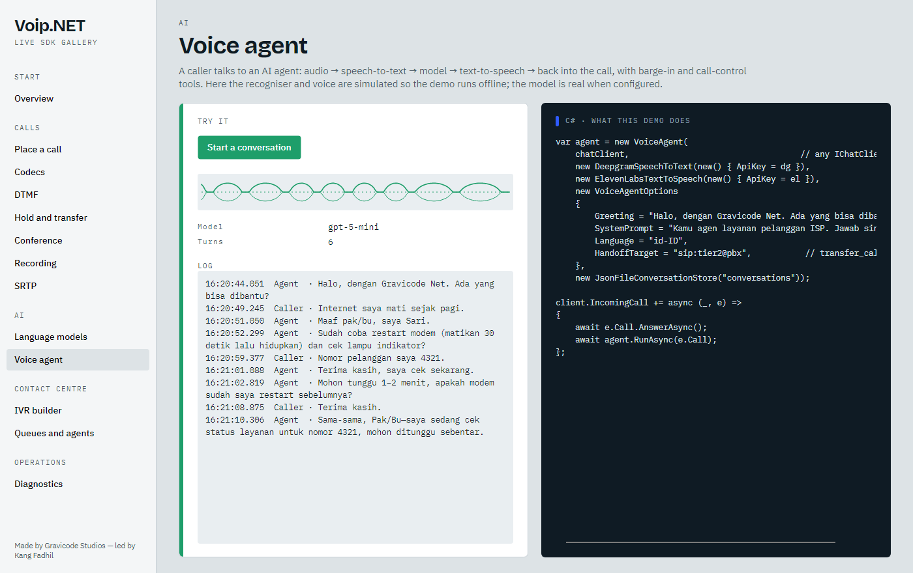

# AI: models, speech and agents

🇮🇩 [Bahasa Indonesia](../id/ai.md) · Made by Gravicode Studios, led by Kang Fadhil



## Language models

Every connector implements `Microsoft.Extensions.AI.IChatClient`, so logging, caching, OpenTelemetry and function invocation middleware from the Microsoft.Extensions.AI ecosystem all apply, and Semantic Kernel can consume them directly.

| Client | Covers |
| --- | --- |
| `OpenAiChatClient` | OpenAI, Azure OpenAI (`OpenAiChatOptions.ForAzure`), DeepSeek, OpenRouter, vLLM, Ollama, LM Studio — any `/chat/completions` server |
| `AnthropicChatClient` | Claude via the Messages API |
| `GeminiChatClient` | Google Gemini via `generateContent` |

All support streaming, system instructions, temperature/top-p/max tokens and tool calling.

```csharp
IChatClient chat = new OpenAiChatClient(OpenAiChatOptions.ForAzure(
    endpoint: "https://my-resource.openai.azure.com/", apiKey: key, deployment: "gpt-5-mini"));

// Reasoning models (GPT-5, o-series) get max_completion_tokens automatically.
// For voice, keep them fast:
var options = OpenAiChatOptions.ForAzure(endpoint, key, "gpt-5-mini");
options.ReasoningEffort = "minimal";

var deepseek = new OpenAiChatClient(new OpenAiChatOptions
{
    BaseUri = new Uri("https://api.deepseek.com/"), ApiKey = key, Model = "deepseek-chat",
});

var claude = new AnthropicChatClient(new AnthropicChatOptions { ApiKey = key, Model = "claude-sonnet-5" });
var gemini = new GeminiChatClient(new GeminiChatOptions { ApiKey = key, Model = "gemini-2.0-flash" });
```

### Tools (AI functions)

```csharp
var ticket = AIFunctionFactory.Create(
    (string customer, string problem) => crm.OpenTicket(customer, problem),
    "open_ticket", "Opens a support ticket.");

using var client = new ChatClientBuilder(chat).UseFunctionInvocation().Build();
var answer = await client.GetResponseAsync("Internet Rina mati, buatkan tiket.", new ChatOptions { Tools = [ticket] });
```

`CallControlTools.Create(call, agent)` gives the model `transfer_call`, `end_call`, `send_dtmf`, `set_hold` and `get_call_quality`. `CrmToolset.Create(connector)` adds `crm_lookup_customer`, `crm_recent_tickets`, `crm_create_ticket` and `crm_add_note`.

### Semantic Kernel

Semantic Kernel accepts any `IChatClient`, so the connectors plug straight into kernels, agents and plugins:

```csharp
var builder = Kernel.CreateBuilder();
builder.Services.AddSingleton<IChatClient>(chat);
builder.Services.AddSingleton<IChatCompletionService>(chat.AsChatCompletionService());
var kernel = builder.Build();
```

Kernel functions can then be handed to the voice agent as tools through `ChatOptions.Tools`.

## Speech

```csharp
public interface ISpeechToText
{
    IAsyncEnumerable<TranscriptSegment> TranscribeAsync(IAsyncEnumerable<AudioChunk> audio, SpeechRecognitionOptions? options, CancellationToken ct);
    Task<string> TranscribeOnceAsync(ReadOnlyMemory<byte> pcm, int sampleRate, SpeechRecognitionOptions? options, CancellationToken ct);
}

public interface ITextToSpeech
{
    int PreferredSampleRate { get; }
    IAsyncEnumerable<AudioChunk> SynthesizeAsync(string text, SpeechSynthesisOptions? options, CancellationToken ct);
}
```

Audio is always 16-bit mono PCM; the engine converts sample rates.

| Provider | STT | TTS | Notes |
| --- | --- | --- | --- |
| Deepgram | `DeepgramSpeechToText` — web socket streaming with interim results | `DeepgramTextToSpeech` (Aura, raw PCM, streamed) | lowest barge-in latency |
| OpenAI | `OpenAiSpeechToText` | `OpenAiTextToSpeech` (PCM 24 kHz, streamed) | works with compatible servers |
| ElevenLabs | `ElevenLabsSpeechToText` (Scribe) | `ElevenLabsTextToSpeech` (PCM at 8–44.1 kHz, streamed) | expressive voices; free plans may only use premade voices through the API (the default `VoiceId` is one) |
| Google Cloud | `GoogleCloudSpeechToText` | `GoogleCloudTextToSpeech` (LINEAR16) | API key or OAuth token; `telephony` model |
| Azure AI Speech | `AzureSpeechToText` (short audio, per utterance) | `AzureTextToSpeech` (raw PCM 8/16/24/48 kHz, streamed) | regional endpoint plus subscription key; neural voices such as `id-ID-GadisNeural` |
| Cartesia | — | `CartesiaTextToSpeech` (raw PCM, streamed) | low latency; `sonic-2` by default |
| Amazon | — | `AmazonPollyTextToSpeech` (PCM 8/16 kHz, SigV4 signed, no AWS SDK) | Transcribe is on the roadmap |
| ElBruno.Realtime | `ElBrunoRealtimeSpeechToText` (web socket) | `ElBrunoRealtimeTextToSpeech` (HTTP PCM) | self-hosted, open source |

Providers without a streaming recogniser derive from `BufferedSpeechToText`: a voice activity detector cuts utterances (with 300 ms pre-roll) and each utterance is transcribed as it ends.

### ElBruno.Realtime protocol

- Recognition: `ws://host/stt?sample_rate=16000&language=id`; send binary 16-bit PCM frames; receive text frames `{"text": "...", "final": true}`.
- Synthesis: `POST http://host/tts` with `{"text", "voice", "sample_rate", "speed", "format": "pcm_s16le"}`; the response body is raw PCM.

## VoiceAgent

```csharp
var agent = new VoiceAgent(chat, speechToText, textToSpeech, new VoiceAgentOptions
{
    Greeting = "Halo, dengan Gravicode Net.",
    SystemPrompt = "Kamu agen layanan pelanggan. Jawab singkat.",
    Language = "id-ID",
    BargeIn = true,
    SilencePrompt = TimeSpan.FromSeconds(12),
    SilenceHangup = TimeSpan.FromSeconds(40),
    HandoffTarget = "sip:tier2@pbx",
    EnableCallControlTools = true,
    ChatOptions = new ChatOptions { Tools = [.. CrmToolset.Create(crm)] },
}, new JsonFileConversationStore("conversations"));

agent.CallerSaid += (_, t) => log.Info($"caller: {t}");
agent.AgentSaid += (_, t) => log.Info($"agent: {t}");
agent.Interrupted += (_, _) => log.Info("barge-in");
await agent.RunAsync(call);
```

How it behaves:

- **Streaming answers.** Model output is cut into sentences and each sentence is synthesised as soon as it is complete.
- **Barge-in.** Recognition keeps running while the agent speaks; an interim transcript cancels the turn and clears queued audio.
- **Memory.** With a conversation store, the last `RestoreTurns` turns are restored for a returning caller (keyed by `ConversationKey` or the caller URI).
- **Hand-off.** `HandOffAsync(target, announcement)` speaks, waits for the audio to finish and transfers. The model can do the same with `transfer_call`.
- **Silence handling.** A prompt after `SilencePrompt`, hang-up after `SilenceHangup`.

With DI, `AddVoiceAgent` registers a `VoiceAgentFactory` that builds one agent per call with per-call adjustments.

### Knowing when the caller has finished

A recogniser ends an utterance on silence, and silence is a poor judge: "my number is…" and "yes" both
end in one. Give the agent a turn detector and it asks a model whether the sentence is finished before
answering:

```csharp
var options = new VoiceAgentOptions
{
    TurnDetector = new SemanticTurnDetector(fastChatClient),   // a small, quick model
    TurnGrace = TimeSpan.FromSeconds(3),
};
```

While the detector says the caller is not done, what they said is held and the next sentence is added to
it, so the model finally sees "my number is 0812 3456 7890" as one question. If nothing more arrives
within `TurnGrace`, the agent answers anyway — a wrong judgement costs a pause, not the call — and a
detector that errors or runs long is treated as "the caller is done" for the same reason.

## RealtimeVoiceAgent

```csharp
var realtime = new RealtimeVoiceAgent(new RealtimeVoiceOptions
{
    ApiKey = openAiKey, Model = "gpt-realtime", Voice = "alloy",
    Instructions = "You are a friendly receptionist.", Greeting = "Hello, how can I help?",
});
await realtime.RunAsync(call);
```

Call audio is resampled to 24 kHz and streamed to the model; response audio is streamed back into the call. Server-side voice activity detection triggers `ClearAudio` when the caller interrupts.

Azure OpenAI realtime deployments use the same agent:

```csharp
var options = RealtimeVoiceOptions.ForAzure("https://my-resource.openai.azure.com", azureKey, "gpt-realtime-mini");
options.Greeting = "Hello, how can I help?";
var agent = new RealtimeVoiceAgent(options);
agent.AgentSaid += (_, text) => Console.WriteLine($"agent: {text}");
agent.ErrorReceived += (_, error) => Console.WriteLine($"provider error: {error}");
```

The agent speaks the generally available realtime protocol by default (`session.type = "realtime"`, audio settings under `audio.input` and `audio.output`); set `Protocol = RealtimeProtocol.Beta` for endpoints that still expect `OpenAI-Beta: realtime=v1`. On Azure, caller transcription needs its own deployment: set `InputTranscriptionModel` to enable `CallerSaid`.

## Post-call analytics

`CallAnalyzer` turns a finished call into something a supervisor can read: a summary, the caller's
sentiment, the topics, what is still open, and a score against a checklist you choose.

```csharp
var analyzer = new CallAnalyzer(chat, speechToText, new CallAnalyzerOptions
{
    Language = "Indonesian",
    QualityChecklist = { "offered the promo before closing" },   // added to the default list
});

recordings.RecordingSaved += async (_, info) =>
{
    var analysis = await analyzer.AnalyzeRecordingAsync(info.Path);
    Console.WriteLine($"{analysis.Sentiment} {analysis.QualityScore}/100 — {analysis.Summary}");
    foreach (var item in analysis.ActionItems)
    {
        Console.WriteLine($"  todo: {item}");
    }
};
```

A recording is transcribed first, so the analyser needs a speech provider; a call an agent already
handled needs none, because the agent kept the turns: `analyzer.AnalyzeAsync(agent.Turns)`. Recordings
are read as WAV, so set `RecordingOptions.Format = RecordingFormat.Wav` when you plan to analyse them.

The model is asked for JSON and the answer is read leniently: a fenced block, a sentence before it or
a score written as text all still produce a usable analysis, and a field the model leaves out keeps its
default instead of failing the report.

## Agent assist

`AgentAssist` sits beside a human agent: it writes the transcript as the call goes on and, whenever the
caller finishes a sentence, offers replies the agent can read out or ignore. Nothing it produces reaches
the caller.

```csharp
var assist = new AgentAssist(chat, speechToText, new AgentAssistOptions
{
    Language = "Indonesian",
    Knowledge = "Pengiriman reguler 2-3 hari kerja. Retur dalam 7 hari.",
    SuggestionCount = 3,
});

assist.TranscriptUpdated += (_, line) => view.Append(line.Speaker, line.Text, line.IsFinal);
assist.SuggestionsUpdated += (_, suggestions) => view.Show(suggestions);
await assist.RunAsync(call, cancellationToken);
```

Interim lines arrive while the caller is still speaking, so the transcript keeps up with the call; only
finished sentences go to the model, and no more often than `MinimumInterval`. `TranscribeAgent` adds a
second recognition stream for the agent's own side, which costs another provider connection but gives
the model both halves of the conversation. The turns it collects feed `CallAnalyzer` when the call ends.

## Choosing an approach

| Need | Use |
| --- | --- |
| Lowest latency, one vendor is fine | `RealtimeVoiceAgent` |
| Choice of model and voice, tools, memory, on-premises options | `VoiceAgent` with Deepgram/ElBruno + any model + ElevenLabs/Polly |
| Deterministic menus first, AI for open questions | `IvrRunner` with `IvrAction.Handoff` → `VoiceAgent` |
