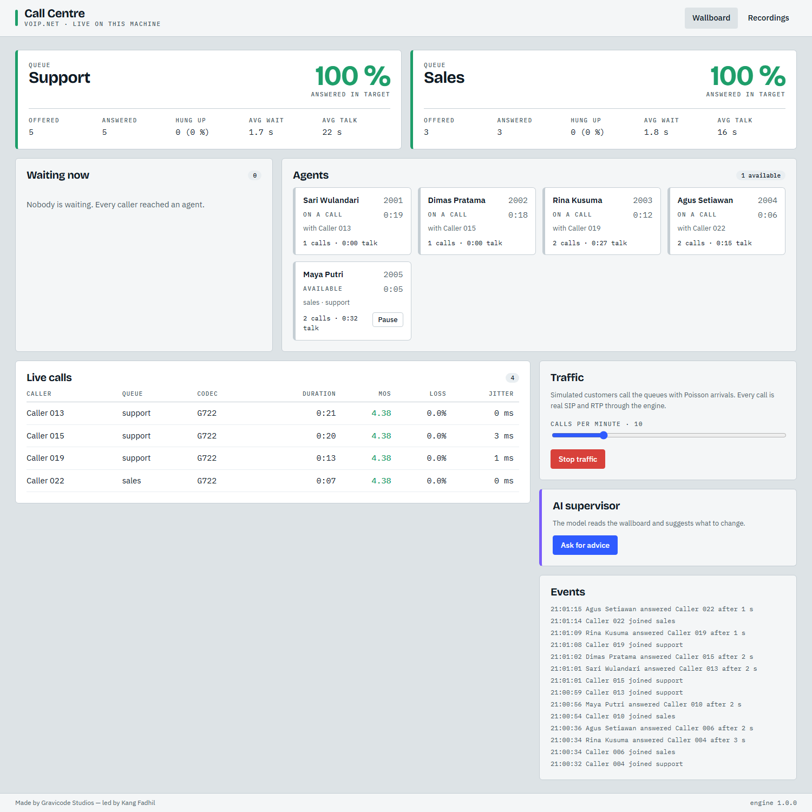
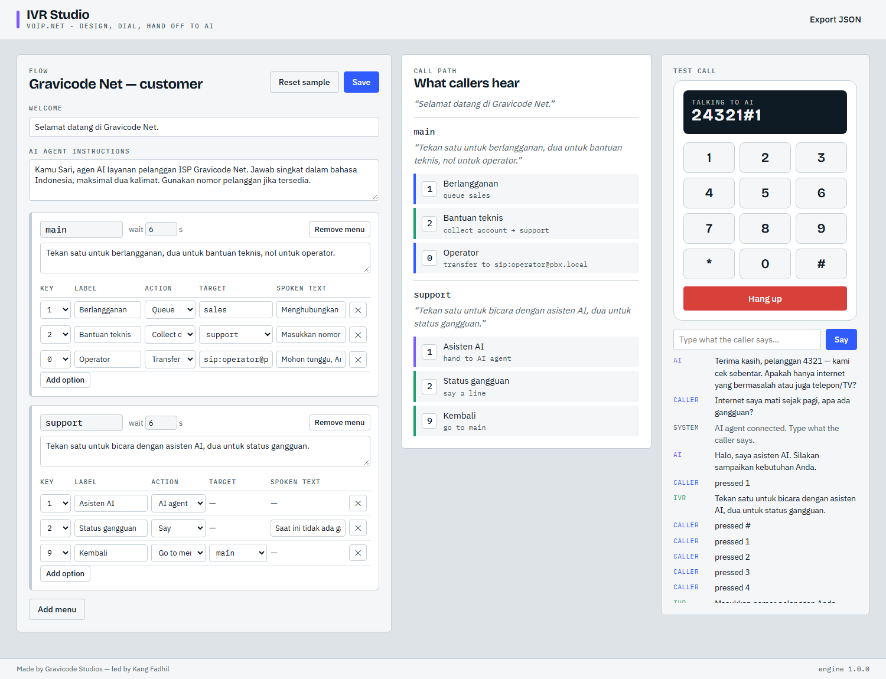

# Contact centre: IVR, queues, recording, CRM

🇮🇩 [Bahasa Indonesia](../id/contact-centre.md) · Made by Gravicode Studios, led by Kang Fadhil



## IVR

```csharp
var flow = IvrFlow.Create()
    .Welcome("Selamat datang di Gravicode Net.")
    .Menu("main", "Tekan 1 untuk penjualan, 2 untuk bantuan teknis, 0 untuk operator.", m => m
        .Option('1', "Sales", new IvrAction.Enqueue("sales", "Menghubungkan ke tim penjualan."))
        .Option('2', "Support", new IvrAction.Collect("account", "Masukkan nomor pelanggan, akhiri dengan pagar.", 8, "support"))
        .Option('0', "Operator", new IvrAction.Transfer("sip:operator@pbx", "Mohon tunggu."))
        .WaitFor(TimeSpan.FromSeconds(6))
        .Attempts(3)
        .OnFailure(new IvrAction.Hangup("Terima kasih.")))
    .Menu("support", "Tekan 1 untuk asisten AI.", m => m
        .Option('1', "AI assistant", new IvrAction.Handoff("ai", (call, context, ct) =>
            agentFactory.Create(o => o.SystemPrompt += $" Nomor pelanggan: {context.Values["account"]}").RunAsync(call, ct)))
        .Option('9', "Back", new IvrAction.Goto("main")))
    .Build();                                 // validates that every target menu exists

var result = await new IvrRunner(textToSpeech).RunAsync(call, flow);
// result.Outcome: Queued · Transferred · HandedOff · Completed · CallerLeft
// result.Context.Values["account"], result.Context.RequestedQueue, result.Context.Path
```

| Action | Effect |
| --- | --- |
| `Goto(menu)` | show another menu |
| `Say(text)` | speak and repeat the current menu |
| `Collect(key, prompt, maxDigits, nextMenu, terminator)` | read digits into `Context.Values[key]` |
| `Transfer(target, announcement)` | REFER the caller elsewhere |
| `Enqueue(queue, announcement)` | stop and report the queue (feed it to `CallCenterService`) |
| `Handoff(name, handler)` | give the call to any async handler, typically a `VoiceAgent` |
| `Hangup(announcement)` | say goodbye and end the call |

Menus can play WAV files (`PromptFromFile`) instead of synthesised prompts.



## Queues and agents

```csharp
var centre = new CallCenterService(pbxClient, textToSpeech);
centre.AddQueue(new CallQueueOptions
{
    Name = "support",
    Strategy = RoutingStrategy.SkillBased,   // RoundRobin · LongestIdle · FewestCalls · SkillBased
    RequiredSkill = "support",
    ServiceLevelTarget = TimeSpan.FromSeconds(20),
    MaxWait = TimeSpan.FromMinutes(5),
    OverflowTarget = "sip:voicemail@pbx",
    RingTimeout = TimeSpan.FromSeconds(25),
    WrapupTime = TimeSpan.FromSeconds(15),
    AnnouncePosition = true,
    MusicOnHoldFile = "hold.wav",
});

centre.AddAgent(new Agent { Id = "2001", Name = "Sari", Uri = "sip:2001@pbx", Skills = { "support", "english" } });
centre.SetAgentState("2001", AgentState.Available);

pbxClient.IncomingCall += async (_, e) =>
{
    await e.Call.AnswerAsync();
    var ivr = await ivrRunner.RunAsync(e.Call, flow);
    if (ivr.Outcome == IvrOutcome.Queued)
    {
        var result = await centre.EnqueueAsync(e.Call, ivr.Context.RequestedQueue!, priority: 0, context: ivr.Context.Values);
    }
};
```

What happens while a caller waits: position announcements and/or music on hold play; when the caller is first in line and an agent with the right skill is available, the agent is reserved (`Ringing`) and called. If the agent answers, both legs are bridged in a conference and the agent is `OnCall`; otherwise the next agent is tried. After the call the agent goes through `Wrapup` back to `Available`.

Supervisor listen-in and whisper:

```csharp
var supervisor = await pbxClient.CallAsync("sip:supervisor@pbx");
centre.Monitor(callerCallId, supervisor, whisper: false);   // listen only
```

Listen-only mode makes the leg to the supervisor send-only: they hear the conversation, but their audio never enters the bridge.

### Metrics

```csharp
var s = centre.Metrics.Snapshot("support");
// Offered, Answered, Abandoned, Overflowed, AverageWait, LongestWait, AverageTalk, ServiceLevel, AbandonRate
centre.Metrics.Changed += (_, _) => dashboard.Refresh();
```

## Recording service

```csharp
using var recordings = new RecordingService(pbxClient, new RecordingOptions
{
    Directory = "recordings", Format = RecordingFormat.Mp3, Layout = RecordingLayout.Stereo,
    RecordAllCalls = true, Retention = TimeSpan.FromDays(90),
});
recordings.RecordingSaved += (_, info) => Upload(info.Path);
var latest = recordings.List(50);           // index stored as JSON next to each file
recordings.ApplyRetention();
```

## CRM tools

Implement `ICrmConnector` over your CRM and give the tools to the model:

```csharp
public sealed class HubSpotConnector : ICrmConnector { … }

var tools = CrmToolset.Create(new HubSpotConnector(...));
var options = new VoiceAgentOptions { ChatOptions = new ChatOptions { Tools = [.. tools] } };
```

`InMemoryCrmConnector` matches phone numbers on their last nine digits, so `+62 812…`, `62812…` and `0812…` refer to the same customer.

## Analytics with AI

The Call Centre sample sends the wallboard snapshot to a model and shows staffing advice — a pattern you can reuse for shift reports, QA summaries of recordings (transcribe with `TranscribeOnceAsync`, summarise with any `IChatClient`), or intent analytics.
