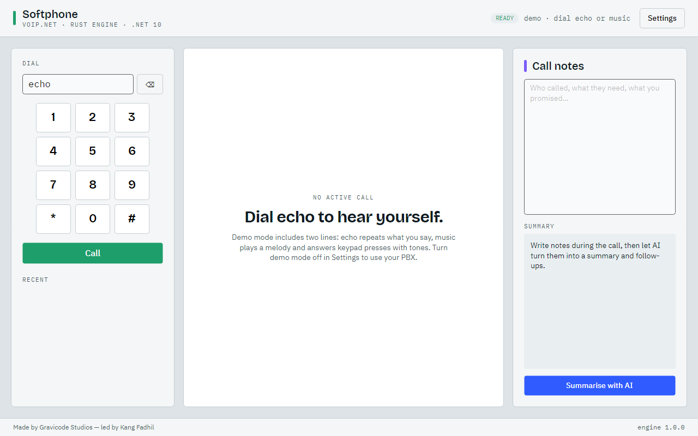
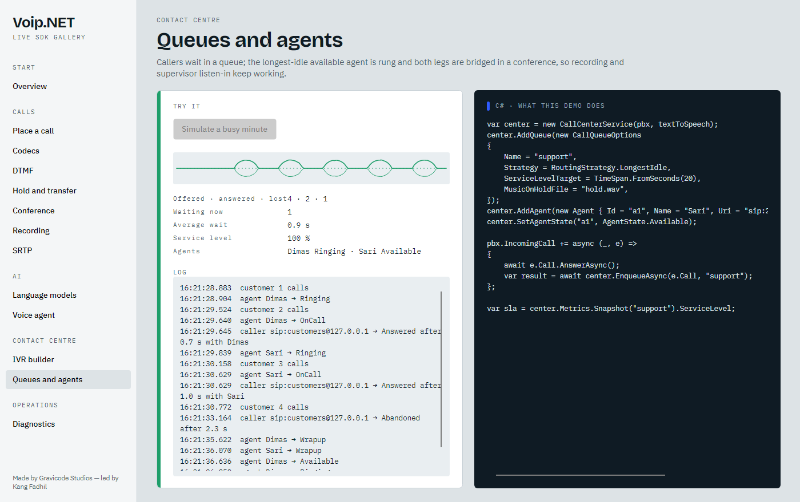
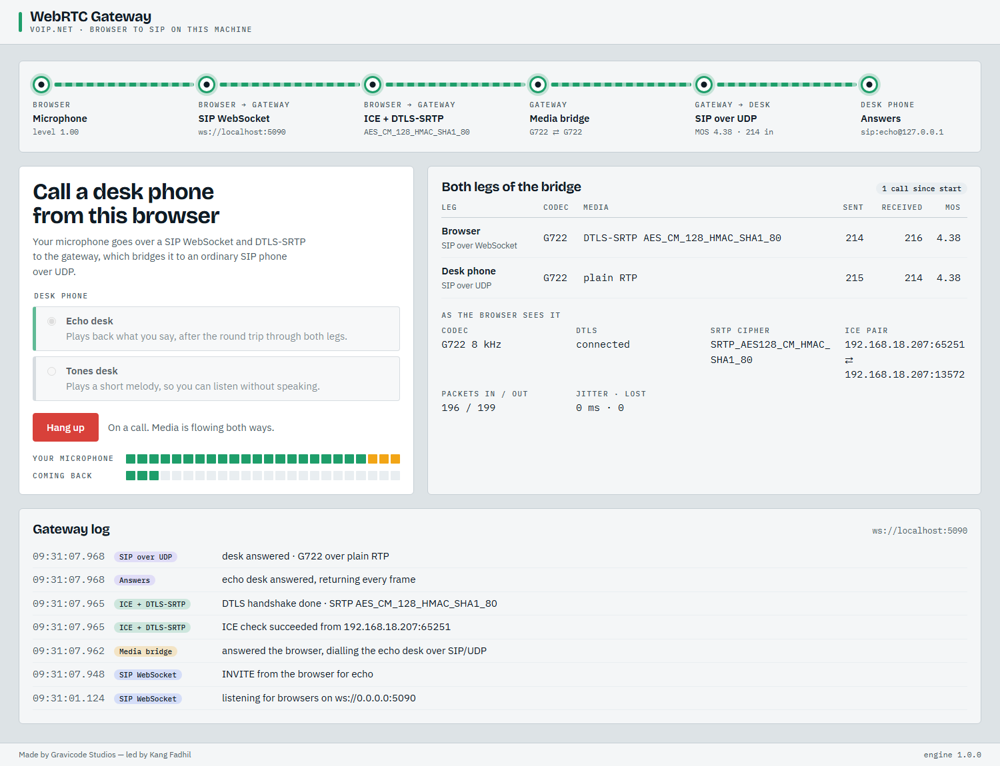

# Tools, diagnostics and samples

🇮🇩 [Bahasa Indonesia](../id/tools-and-diagnostics.md) · Made by Gravicode Studios, led by Kang Fadhil

## The `voipnet` CLI

```bash
dotnet tool install -g VoipNet.Cli
voipnet --help
```

| Command | Purpose |
| --- | --- |
| `voipnet version` | SDK, engine and runtime versions |
| `voipnet sip ping <uri> [--count 4]` | OPTIONS round-trip times and the responder's User-Agent |
| `voipnet sip register -d pbx -u 1001 -p secret` | test credentials against a registrar |
| `voipnet sip call <uri> [--duration 10] [--tone 440] [--dtmf 123] [--record out.wav] [--register]` | place a test call and watch MOS, loss, jitter live |
| `voipnet sip listen [--sip-port 5060] [--echo]` | answer calls; `--echo` turns it into an echo test service |
| `voipnet sip message <uri> "text"` | send a SIP MESSAGE |
| `voipnet rtp analyze capture.pcap [--json]` | loss, jitter, ordering and MOS for every RTP stream in a capture |
| `voipnet rtp listen --port 40000 [--seconds 30]` | receive RTP on a port and analyse it live |

Common options for `sip` commands: `--domain`, `--user`, `--password`, `--proxy`, `--transport udp|tcp|tls|ws|wss`, `--tls-pin fingerprint`, `--tls-insecure`, `--srtp`, `--dtls` (DTLS-SRTP keys), `--bind`, `--port`, `--trace` (print SIP), `--pcap file` (write SIP to a capture).

Example — an echo test in two terminals:

```bash
voipnet sip listen --sip-port 5090 --echo
voipnet sip call sip:echo@127.0.0.1:5090 --duration 5 --dtmf 123 --pcap call.pcap
```

```
Connected codec G722 @ 16000 Hz
╭─────────────────────────┬─────────────────╮
│ MOS (estimated)         │            4.38 │
│ Packets sent / received │       194 / 174 │
│ Lost / late             │    0 / 0 (0.0%) │
│ Jitter                  │          0.2 ms │
╰─────────────────────────┴─────────────────╯
```

## Diagnostics in code

### SIP capture

```csharp
var client = new VoipClient(new VoipClientOptions { TraceSip = true, … });
using var capture = new PcapWriter("sip.pcap");
capture.Attach(client);         // open the file in Wireshark: SIP is decoded
client.SipTrace += (_, e) => logger.LogDebug("{Dir} {Remote}\n{Msg}", e.Outgoing ? "→" : "←", e.RemoteEndPoint, e.Message);
```

### RTP analysis

```csharp
foreach (var s in RtpStreamAnalyzer.AnalyzeFile("trunk.pcap"))
    Console.WriteLine($"0x{s.Ssrc:X8} {s.Codec} {s.Source}→{s.Destination} loss {s.LossPercent:0.0}% jitter {s.JitterMs:0.0} ms MOS {s.Mos:0.00}");

var live = new RtpStreamAnalyzer();
live.Add(new UdpDatagram(DateTimeOffset.UtcNow, remote, local, packet));
```

libpcap files with Ethernet, raw IP, Linux cooked or loopback link types are supported (convert pcapng with `editcap -F pcap`).

### Metrics

Meter `VoipNet`:

| Instrument | Type |
| --- | --- |
| `voipnet.calls.started` (tag `direction`) | counter |
| `voipnet.calls.answered` | counter |
| `voipnet.calls.failed` (tag `code`) | counter |
| `voipnet.calls.active` | up-down counter |
| `voipnet.call.duration` (s) | histogram |
| `voipnet.call.mos` | histogram |
| `voipnet.call.packet_loss` (%) | histogram |
| `voipnet.registrations` (tag `state`) | counter |

```bash
dotnet-counters monitor --counters VoipNet -n VoipNet.CallCenter
```

Or export with OpenTelemetry: `builder.Services.AddOpenTelemetry().WithMetrics(m => m.AddMeter("VoipNet"))`.

### Logging

Pass an `ILogger<VoipClient>`; engine log events (NAT discovery, send failures, media errors) are forwarded at matching levels.

## Samples

### Softphone (Avalonia)



- Demo mode starts two in-process lines: **echo** (hear yourself) and **music** (a melody that answers keypad presses with tones).
- Live audio traces for both directions, codec and MOS, mute/hold/keypad/record/transfer.
- Notes panel with **Summarise with AI** (any OpenAI-compatible endpoint).
- `dotnet run --project samples/VoipNet.Softphone -- --screenshot docs/images` renders the documentation screenshots headlessly.

### Gallery (Avalonia)



Thirteen live pages: overview, place a call, codecs, DTMF, hold and transfer, conference, recording, SRTP, language models (with a real tool call), voice agent, IVR builder, queues and agents, diagnostics. Each page shows the C# that does what the demo does. Configure models with `VOIPNET_AI_ENDPOINT`, `VOIPNET_AI_KEY`, `VOIPNET_AI_MODEL`.

### Call Centre (Blazor Server)

A PBX, five agent softphones and a Poisson traffic generator, all real SIP/RTP on loopback. Wallboard with service level, waiting callers drawn against their target, agent board, live call quality, events, traffic controls and an **AI supervisor**; a Recordings page with in-browser playback.

### IVR Studio (Blazor Server)

Edit menus, options and AI instructions; see the call path; press keys on a phone in the browser that dials the flow for real; type as the caller once the IVR hands off to the AI agent. Flows are saved to `App_Data/flow.json` and exported at `/flow.json`.

### WebPhone (Blazor Server)



A WebRTC gateway on one machine. The page's script is a small SIP-over-WebSocket client: it calls the gateway endpoint (`ws://host:5090`) with an `RTCPeerConnection` offer, and the gateway answers with ICE and DTLS-SRTP, then relays the audio to an ordinary SIP/UDP call to a desk phone (an echo or a tone player). The signal path at the top lights up hop by hop; both legs show codec, encryption, packets and MOS, next to what the browser itself reports from `getStats()`.

### Realtime Agent (console)

```bash
dotnet run --project samples/VoipNet.RealtimeAgent             # answer SIP calls on :5070
dotnet run --project samples/VoipNet.RealtimeAgent -- --demo   # scripted caller + real model
```

Configure providers in `appsettings.json` (`AI:Chat`, `AI:SpeechToText`, `AI:TextToSpeech`, `AI:Realtime`) and set `Agent:Mode` to `pipeline` or `realtime`.

### Documentation screenshots

`tools/VoipNet.DocShots` drives headless Edge/Chrome through the DevTools protocol to capture the Blazor samples:

```bash
dotnet run --project tools/VoipNet.DocShots -- ivrstudio http://127.0.0.1:5209 docs/images
dotnet run --project tools/VoipNet.DocShots -- callcenter http://127.0.0.1:5184 docs/images
dotnet run --project tools/VoipNet.DocShots -- webphone http://localhost:5190 docs/images
```
