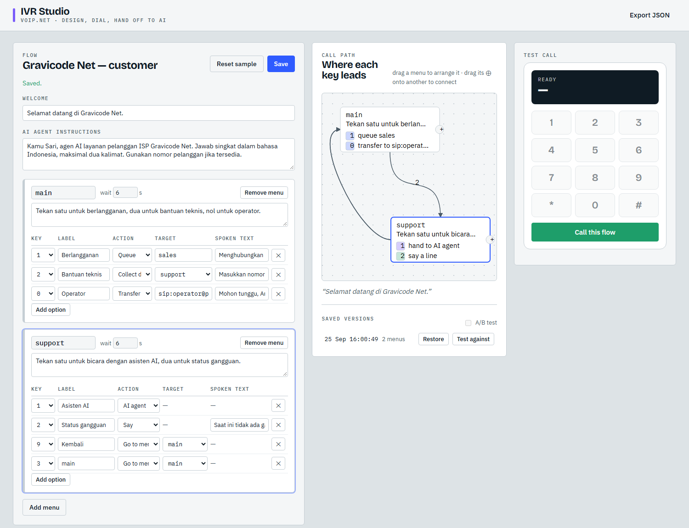
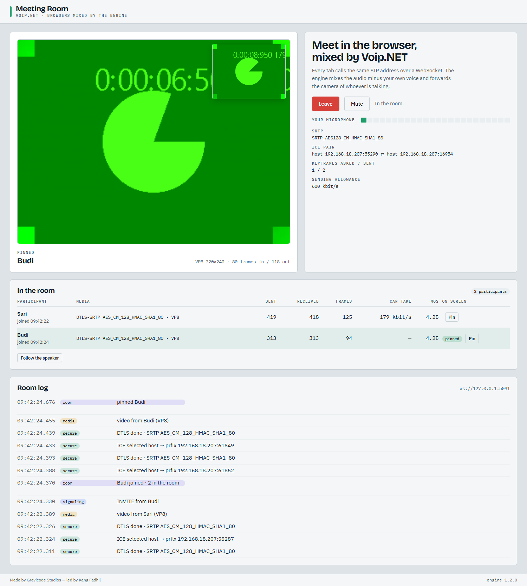

# Tools, diagnostik, dan sample

🇬🇧 [English](../en/tools-and-diagnostics.md) · Dibuat oleh Gravicode Studios, dipimpin oleh Kang Fadhil

## CLI `voipnet`

```bash
dotnet tool install -g VoipNet.Cli
voipnet --help
```

| Perintah | Kegunaan |
| --- | --- |
| `voipnet version` | versi SDK, engine, dan runtime |
| `voipnet sip ping <uri> [--count 4]` | waktu tempuh OPTIONS dan User-Agent penjawab |
| `voipnet sip register -d pbx -u 1001 -p rahasia` | menguji kredensial ke registrar |
| `voipnet sip call <uri> [--duration 10] [--tone 440] [--dtmf 123] [--record out.wav] [--register] [--video clip.h264 \| --camera \| --screen] [--video-fps 15]` | panggilan uji dengan pemantauan MOS, loss, jitter secara langsung; `--video` mengirim file H.264, `--camera` dan `--screen` meng-encode gambar mesin ini sendiri |
| `voipnet sip listen [--sip-port 5060] [--echo] [--video]` | menjawab panggilan; `--echo` menjadikannya layanan uji gema, `--video` menerima (dan memantulkan) video |
| `voipnet sip message <uri> "teks"` | mengirim SIP MESSAGE |
| `voipnet load <uri> [-n 20] [--concurrency 4] [--cps 2] [--duration 5]` | membuat panggilan dengan laju tetap dan melaporkan waktu setup, kegagalan, serta kualitas media |
| `voipnet rtp analyze capture.pcap [--json]` | loss, jitter, urutan, dan MOS setiap stream RTP dalam capture |
| `voipnet rtp listen --port 40000 [--seconds 30]` | menerima RTP pada port dan menganalisisnya secara langsung |

Opsi umum untuk perintah `sip`: `--domain`, `--user`, `--password`, `--proxy`, `--transport udp|tcp|tls|ws|wss`, `--tls-pin fingerprint`, `--tls-insecure`, `--srtp`, `--dtls` (DTLS-SRTP keys), `--bind`, `--port`, `--trace` (cetak SIP), `--pcap file` (tulis SIP ke capture).

Contoh — uji gema di dua terminal:

```bash
voipnet sip listen --sip-port 5090 --echo
voipnet sip call sip:echo@127.0.0.1:5090 --duration 5 --dtmf 123 --pcap call.pcap
```

```
Connected codec G722 @ 16000 Hz
╭─────────────────────────┬─────────────────╮
│ MOS (estimated)         │            4.38 │
│ Packets sent / received │       194 / 174 │
│ Lost / late             │    0 / 0 (0.0%) │
│ Jitter                  │          0.2 ms │
╰─────────────────────────┴─────────────────╯
```

Contoh — 50 panggilan, 5 per detik, 10 sekaligus:

```bash
voipnet load sip:echo@pbx.contoh.co.id -n 50 --cps 5 --concurrency 10 --duration 8
```

```
╭───────────────────────┬────────────────────╮
│ Calls placed          │ 50                 │
│ Connected             │ 50                 │
│ Failed                │ 0                  │
│ Achieved rate         │ 4.91 calls/s       │
│ Peak concurrent       │ 10                 │
│ Setup p50 / p95 / max │ 112 / 186 / 233 ms │
│ MOS (average)         │ 4.31               │
│ Packet loss (average) │ 0.04 %             │
╰───────────────────────┴────────────────────╯
```

Laju yang tercapai adalah yang benar-benar diterima lawan: batas konkurensi dan durasi panggilan
menahannya, jadi laju di bawah permintaan berarti panggilan mengantre di batas itu. Perintah ini
keluar dengan kode bukan nol bila ada panggilan yang gagal, sesuai kebutuhan job CI. MOS hanya terisi
bila target mengirim audio balik — arahkan ke layanan echo atau IVR, bukan ke yang menjawab tanpa suara.

Contoh — uji echo video dengan klip buatan ffmpeg:

```bash
ffmpeg -f lavfi -i testsrc=size=320x240:rate=15:duration=3 -c:v libx264 -g 15 -f h264 clip.h264
voipnet sip listen --echo --video
voipnet sip call sip:echo@127.0.0.1:5060 --duration 4 --tone 0 --video clip.h264
voipnet sip call sip:echo@127.0.0.1:5060 --duration 10 --screen --video-fps 10
```

File dibaca sebagai Annex B dan dikirim satu access unit per frame, berulang sampai panggilan selesai;
parameter set ikut bersama keyframe yang dijelaskannya sehingga sisi lawan bisa mulai men-decode di
situ. Video yang kembali diukur seperti yang dirasakan penonton: laju frame, bitrate, seberapa sering
keyframe datang (itulah lama menunggu gambar pertama), dan jeda terpanjang antar-frame alias freeze.

## Diagnostik di kode

### Capture SIP

```csharp
var client = new VoipClient(new VoipClientOptions { TraceSip = true, … });
using var capture = new PcapWriter("sip.pcap");
capture.Attach(client);         // buka di Wireshark: SIP ter-decode
client.SipTrace += (_, e) => logger.LogDebug("{Dir} {Remote}\n{Msg}", e.Outgoing ? "→" : "←", e.RemoteEndPoint, e.Message);
```

### Analisis RTP

```csharp
foreach (var s in RtpStreamAnalyzer.AnalyzeFile("trunk.pcap"))
    Console.WriteLine($"0x{s.Ssrc:X8} {s.Codec} {s.Source}→{s.Destination} loss {s.LossPercent:0.0}% jitter {s.JitterMs:0.0} ms MOS {s.Mos:0.00}");

var live = new RtpStreamAnalyzer();
live.Add(new UdpDatagram(DateTimeOffset.UtcNow, remote, local, packet));
```

File libpcap dengan link type Ethernet, raw IP, Linux cooked, atau loopback didukung (konversi pcapng dengan `editcap -F pcap`).

### Metrik

Meter `VoipNet`:

| Instrumen | Jenis |
| --- | --- |
| `voipnet.calls.started` (tag `direction`) | counter |
| `voipnet.calls.answered` | counter |
| `voipnet.calls.failed` (tag `code`) | counter |
| `voipnet.calls.active` | up-down counter |
| `voipnet.call.duration` (s) | histogram |
| `voipnet.call.mos` | histogram |
| `voipnet.call.packet_loss` (%) | histogram |
| `voipnet.registrations` (tag `state`) | counter |

```bash
dotnet-counters monitor --counters VoipNet -n VoipNet.CallCenter
```

Atau ekspor dengan OpenTelemetry: `builder.Services.AddOpenTelemetry().WithMetrics(m => m.AddMeter("VoipNet"))`.

### Tracing

Activity source `VoipNet`. Setiap panggilan menjadi satu span (`sip.call`) yang dibuka saat panggilan
dimulai atau masuk dan ditutup saat panggilan berakhir, dengan tag arah, URI lawan, status code
terakhir, codec, serta kualitas akhir panggilan (`voip.mos`, `voip.loss_percent`, `voip.jitter_ms`).
Panggilan keluar melanjutkan activity yang memulainya, sehingga panggilan muncul di bawah request yang
memicunya. Voice agent menambah span anak per giliran (`voip.agent.turn`) berisi model dan event ketika
penelepon menyela.

```csharp
builder.Services.AddOpenTelemetry()
    .WithTracing(t => t.AddSource(VoipTelemetry.ActivitySourceName).AddOtlpExporter())
    .WithMetrics(m => m.AddMeter(VoipMetrics.MeterName));
```

Tidak ada yang direkam selama tidak ada listener; `VoipTelemetry.Enabled` menunjukkan statusnya.

### Logging

Berikan `ILogger<VoipClient>`; event log engine (deteksi NAT, kegagalan kirim, error media) diteruskan dengan level yang sesuai.

## Sample

### Softphone (Avalonia)


- Mode demo menjalankan dua jalur dalam proses: **echo** (mendengar suara sendiri) dan **music** (melodi yang menjawab tombol keypad dengan nada).
- Trace audio langsung untuk kedua arah, codec dan MOS, mute/hold/keypad/rekam/transfer.
- Panel catatan dengan **Summarise with AI** (endpoint kompatibel OpenAI apa pun).
- **Camera** menyalakan webcam bila platformnya punya codec (baru Windows): gambarnya ditangkap, di-encode ke H.264, dikirim lewat RTP, lalu ditampilkan kembali setelah didekode — lawan bicara besar, diri sendiri di pojok. Jalur demo echo mengirim gambarnya kembali frame demi frame, sehingga seluruh jalurnya bisa dilihat di satu mesin.
- `dotnet run --project samples/VoipNet.Softphone -- --screenshot docs/images` merender screenshot dokumentasi tanpa tampilan.

### Gallery (Avalonia)


Empat belas halaman langsung: overview, melakukan panggilan, codec, DTMF, hold dan transfer, konferensi, video (di-encode, dikirim lewat panggilan nyata, lalu dibandingkan dengan yang kembali), perekaman, SRTP, model bahasa (dengan tool call nyata), voice agent, builder IVR, antrean dan agen, diagnostik. Setiap halaman menampilkan kode C# yang melakukan hal yang sama. Atur model dengan `VOIPNET_AI_ENDPOINT`, `VOIPNET_AI_KEY`, `VOIPNET_AI_MODEL`.

### Call Centre (Blazor Server)

Sebuah PBX, lima softphone agen, dan generator trafik Poisson — semuanya SIP/RTP nyata di loopback. Wallboard dengan service level, penelepon yang menunggu digambar terhadap targetnya, papan agen, kualitas panggilan langsung, event, kontrol trafik, dan **supervisor AI**; halaman Recordings dengan pemutaran di browser.

### IVR Studio (Blazor Server)



Sunting menu, opsi, dan instruksi AI; tekan tombol di telepon dalam browser yang benar-benar menelepon
flow-nya; ketik sebagai penelepon setelah IVR menyerahkan panggilan ke agen AI. Flow disimpan ke
`App_Data/flow.json` dan diekspor di `/flow.json`.

Jalur panggilan kini berupa graf yang bisa ditata: setiap menu adalah node, setiap tombol yang menuju
suatu tempat adalah kabel di antara keduanya, dan tombol yang dijawab menu itu sendiri tampil di
dalamnya dengan warna sesuai perannya. Seret menu untuk memindahkannya — posisinya ikut tersimpan
bersama flow — dan seret ⊕ di sisi kanannya ke menu lain untuk menghubungkan keduanya, yang menambah
tombol menuju menu itu. Tombol yang mengembalikan penelepon melengkung lewat sisi kiri, jadi tidak
menutupi tombol yang membawanya maju.

Setiap penyimpanan menyimpan satu versi. Pulihkan salah satunya untuk membatalkan hasil sesi
penyuntingan, atau pilih satu sebagai **variant B** lalu nyalakan uji A/B: sejak itu sebagian panggilan
uji akan mendengar versi tersimpan itu alih-alih flow saat ini, dan panelnya menyebutkan versi mana
yang didapat tiap panggilan.

### WebPhone (Blazor Server)


Gateway WebRTC dalam satu mesin. Script halaman adalah client SIP over WebSocket kecil: ia menelepon endpoint gateway (`ws://host:5090`) dengan offer `RTCPeerConnection`, lalu gateway menjawab dengan ICE dan DTLS-SRTP dan meneruskan audionya ke panggilan SIP/UDP biasa menuju telepon meja (echo atau pemutar nada). Jalur sinyal di bagian atas menyala hop demi hop; kedua leg menampilkan codec, enkripsi, paket, dan MOS, berdampingan dengan laporan browser sendiri dari `getStats()`.

Centang **Send video too** dan kamera ikut melewati jalur terenkripsi yang sama: engine merakit
kembali frame-nya, gateway langsung mengirimkannya balik, dan gambar yang kembali diputar di bawah meter.
Di bawahnya ada kanal data panggilan: ketik satu baris dan meja menjawabnya di sana — SCTP di dalam
terowongan DTLS-nya sendiri (RFC 8831), berdampingan dengan media. Setiap baris media memakai transport
sendiri, bukan BUNDLE, karena setiap stream punya port sendiri di sini — jadi halamannya meminta
`max-compat` ke browser. Uji interop di CI berjalan dengan kamera palsu dan gagal bila video serta
jawaban di kanal data tidak ikut kembali.

### Meeting (Blazor Server)



Ruang rapat untuk browser. Setiap tab menelepon alamat SIP yang sama lewat WebSocket
(`ws://host:5091`) dengan ICE dan DTLS-SRTP, lalu setiap panggilan bergabung ke satu konferensi:
engine mencampur audio tanpa suara si pendengar sendiri dan meneruskan kamera orang yang sedang
bicara, karena video dirutekan, bukan dicampur. Panggung menampilkan satu gambar itu dengan kamera
Anda sendiri di sudut, daftar peserta menampilkan enkripsi, paket, frame yang dirakit ulang, dan MOS,
dan **Pin** mengunci gambar pada satu peserta sampai **Follow the speaker** mengembalikannya ke ruangan.

```bash
dotnet run --project samples/VoipNet.Meeting        # http://localhost:5195, lalu buka tab kedua
```

`tools/VoipNet.DocShots meeting` menjalankan dua browser headless masuk ke ruangan dan gagal bila
salah satu tidak berhasil men-decode video dari yang lain — begitulah perutean video konferensi
diperiksa di setiap build CI.

### Realtime Agent (console)

```bash
dotnet run --project samples/VoipNet.RealtimeAgent             # menjawab panggilan SIP di :5070
dotnet run --project samples/VoipNet.RealtimeAgent -- --demo   # penelepon skrip + model nyata
```

Atur provider di `appsettings.json` (`AI:Chat`, `AI:SpeechToText`, `AI:TextToSpeech`, `AI:Realtime`) dan pilih `Agent:Mode` `pipeline` atau `realtime`.

### Screenshot dokumentasi

`tools/VoipNet.DocShots` mengendalikan Edge/Chrome headless (DevTools protocol) atau Firefox (WebDriver BiDi, `--firefox [path]`) untuk menangkap sample Blazor. Skenario `webphone` dan `meeting` sekaligus menjadi uji interop browser: `webphone` mencetak statistik WebRTC dari browser dan keluar dengan kode 1 bila panggilan tidak membawa audio terenkripsi, video, dan satu pesan kanal data dua arah; `meeting` memasukkan dua browser ke satu konferensi dan keluar dengan kode 1 bila salah satunya tidak men-decode kamera yang diteruskan dari yang lain.

```bash
dotnet run --project tools/VoipNet.DocShots -- ivrstudio http://127.0.0.1:5209 docs/images
dotnet run --project tools/VoipNet.DocShots -- callcenter http://127.0.0.1:5184 docs/images
dotnet run --project tools/VoipNet.DocShots -- webphone http://localhost:5190 docs/images
dotnet run --project tools/VoipNet.DocShots -- webphone http://localhost:5190 out --firefox "C:\Program Files\Mozilla Firefox\firefox.exe"
```
